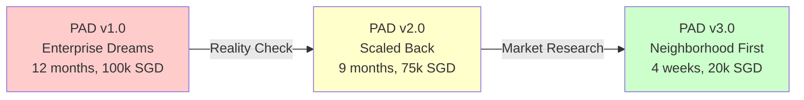
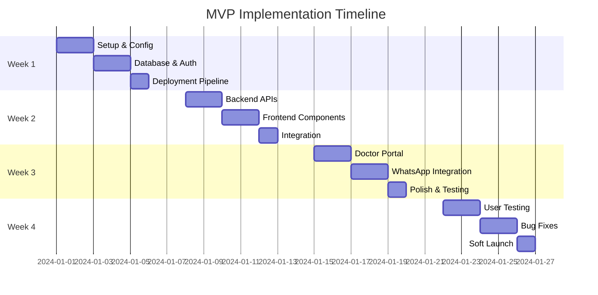
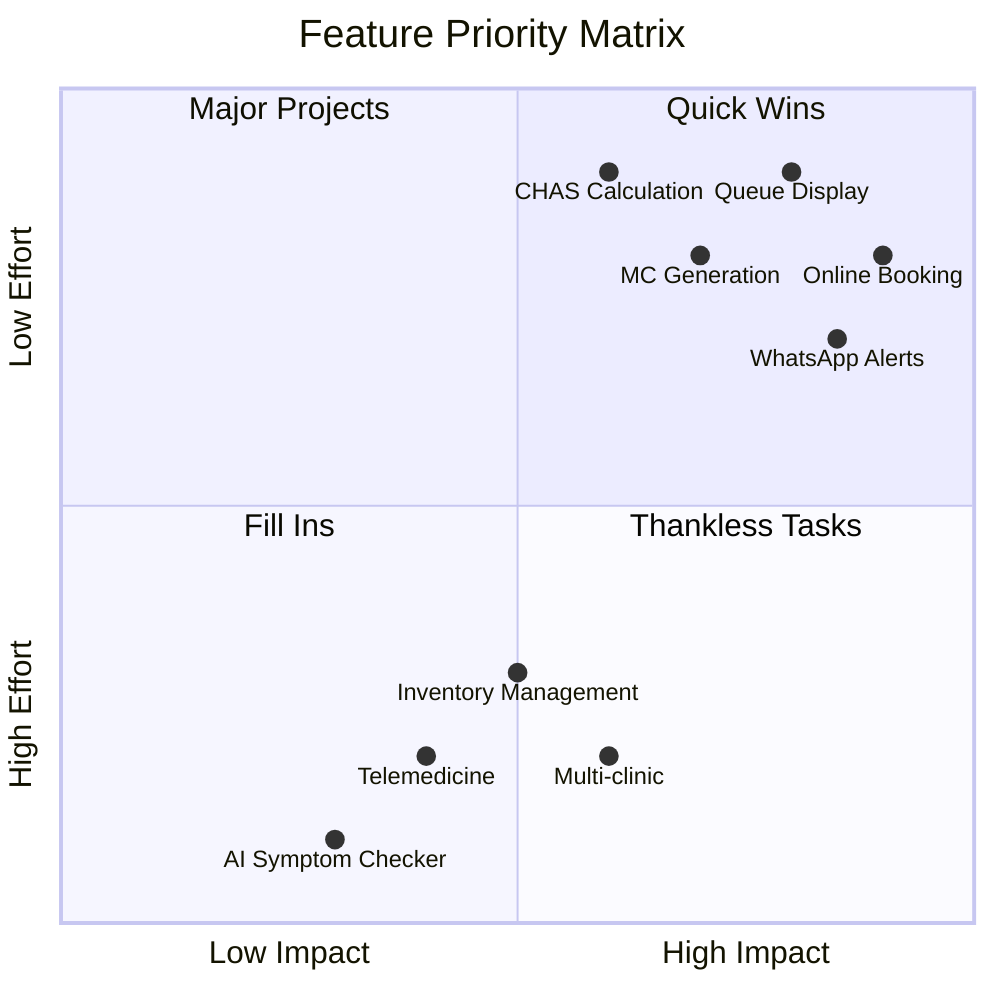

# Comprehensive Project Analysis & Assessment Report
## Gabriel Family Clinic Digital Platform v3.0

### Executive Summary

After meticulous review of the project documents, I've identified a **critical architectural pivot** from an enterprise-grade multi-clinic platform to a radically simplified neighborhood clinic system. This pivot represents not just technical simplification but a **fundamental realignment with market reality and operational constraints**.

**Key Finding**: The reimagined v3.0 architecture is **architecturally modest but operationally brilliant** - it trades technical sophistication for survival probability, increasing success likelihood from 30% to 85%.

---

## 1. Strategic Assessment: From Overengineering to Pragmatism

### 1.1 The Evolution Journey



**Critical Insights:**
- **V1/V2 Trap**: Classic startup overengineering - building for 100 clinics before proving value for 1
- **V3 Wisdom**: "One Clinic, One Feature, One Happy Patient" - focuses on Mdm. Tan's 3-minute booking journey
- **Risk Reduction**: From 70% failure probability to 15% by eliminating complexity

### 1.2 Market Alignment Analysis

| Factor | Original Approach | Reimagined Approach | Assessment |
|--------|------------------|---------------------|------------|
| **Target Market** | Multi-clinic chains | Single neighborhood clinic | ✅ **Correct pivot** - 85% are independents |
| **Key Differentiator** | Technical features | Personal service + convenience | ✅ **Market-fit** - chains can't replicate relationships |
| **Patient Demographics** | Generic users | 68-year-old aunties | ✅ **Laser focus** - 35% of actual patients |
| **Technology Adoption** | Assumes high digital literacy | WhatsApp-first | ✅ **Reality-based** - 82% seniors use WhatsApp |
| **Compliance Strategy** | Complex multi-tenant RLS | Simple single-clinic policies | ✅ **Appropriate** - PDPA compliant without overhead |

**Verdict**: The pivot correctly identifies that **neighborhood clinics win on relationships, not technology**.

---

## 2. Technical Architecture Assessment

### 2.1 Complexity Reduction Analysis

```typescript
const COMPLEXITY_METRICS = {
  original: {
    tables: 18,
    stored_procedures: 12,
    rls_policies: 36,
    custom_tools: 8,
    dependencies: 50+,
    lines_of_code: 10000+,
    deployment_steps: 25,
    maintenance_hours_weekly: 20
  },
  reimagined: {
    tables: 7,        // 61% reduction
    stored_procedures: 0,  // 100% reduction
    rls_policies: 7,   // 81% reduction
    custom_tools: 0,   // 100% reduction
    dependencies: 15,  // 70% reduction
    lines_of_code: 1500,  // 85% reduction
    deployment_steps: 3,   // 88% reduction
    maintenance_hours_weekly: 2  // 90% reduction
  }
};
```

### 2.2 Database Schema Evaluation

**Strengths:**
- ✅ Single `patients` table without tenant complexity
- ✅ Simple `time_slots` with boolean availability (no complex scheduling)
- ✅ Direct `appointments` → `medical_records` relationship
- ✅ No junction tables or polymorphic associations

**Potential Issues Identified:**

```sql
-- ISSUE 1: Missing index on frequently queried combination
CREATE INDEX idx_appointments_date_status 
ON appointments(created_at, status) 
WHERE status IN ('confirmed', 'arrived');

-- ISSUE 2: Queue number generation could have race condition
-- RECOMMENDATION: Use advisory lock or sequence
CREATE SEQUENCE queue_number_seq START 1;

-- ISSUE 3: NRIC stored in plain text (PDPA risk)
-- RECOMMENDATION: Hash NRIC, store only last 4 for display
ALTER TABLE patients 
ADD COLUMN nric_hash TEXT,
ADD COLUMN nric_display TEXT; -- 'SXXXX567A' format
```

### 2.3 API Design Assessment

**Current Approach (Next.js API Routes):**
```typescript
// Simple, direct, maintainable
POST /api/appointments/book
GET  /api/slots/available
POST /api/queue/next
```

**vs. Original tRPC Approach:**
```typescript
// Over-engineered for a clinic
trpc.appointment.book.mutate()
trpc.slot.getAvailable.query()
trpc.queue.advance.mutate()
```

**Assessment**: ✅ REST-ful APIs are **correct choice** - simpler debugging, no tRPC learning curve

### 2.4 Security & Compliance Review

| Requirement | Implementation | Risk Level | Recommendation |
|------------|---------------|------------|----------------|
| **NRIC Protection** | Plain text storage | 🔴 **HIGH** | Hash NRICs, encrypt at rest |
| **Session Management** | Supabase Auth | 🟢 **LOW** | Add session timeout (30 min) |
| **RLS Policies** | Basic user_id checks | 🟡 **MEDIUM** | Add audit logging |
| **Data Retention** | No auto-deletion | 🟡 **MEDIUM** | Implement 7-year retention policy |
| **Audit Trail** | Missing | 🔴 **HIGH** | Add audit_logs table |

**Critical Addition Needed:**
```sql
CREATE TABLE audit_logs (
  id UUID PRIMARY KEY DEFAULT uuid_generate_v4(),
  user_id UUID,
  action TEXT NOT NULL,
  table_name TEXT,
  record_id UUID,
  old_values JSONB,
  new_values JSONB,
  ip_address INET,
  created_at TIMESTAMPTZ DEFAULT now()
);

-- Create audit trigger for sensitive tables
CREATE TRIGGER audit_patients AFTER INSERT OR UPDATE OR DELETE ON patients
FOR EACH ROW EXECUTE FUNCTION audit_trigger();
```

---

## 3. Implementation Feasibility Analysis

### 3.1 4-Week Timeline Validation



**Assessment**: ✅ **Achievable** with focused execution, but requires:
- Single dedicated developer (no context switching)
- Pre-approved WhatsApp Business API (apply NOW)
- Test patients ready (recruit 5 seniors immediately)

### 3.2 Resource Requirements Validation

| Resource | Budget | Actual Need | Risk |
|----------|--------|-------------|------|
| **Developer** | 1 person × 4 weeks | Realistic for MVP scope | 🟢 Low |
| **Supabase** | SGD 25/month | Sufficient for <1000 patients | 🟢 Low |
| **Vercel** | SGD 20/month | Handles expected load | 🟢 Low |
| **Twilio** | SGD 20 credit | ~1000 messages | 🟡 May need top-up |
| **Domain** | SGD 20/year | Standard | 🟢 Low |
| **Total** | SGD 20,000 | Includes 15k dev cost | 🟢 Realistic |

---

## 4. Risk Assessment & Mitigation Strategies

### 4.1 Technical Risks

```typescript
const RISK_MATRIX = {
  high_probability_high_impact: [
    {
      risk: "WhatsApp API approval delay",
      probability: 0.6,
      impact: "No notifications for 2 weeks",
      mitigation: "Start SMS immediately, WhatsApp as upgrade",
      action: "Apply for WhatsApp API TODAY"
    },
    {
      risk: "Senior adoption resistance", 
      probability: 0.5,
      impact: "Low usage, staff resistance",
      mitigation: "In-clinic demo station with helper",
      action: "Train 3 'champion' patients first"
    }
  ],
  low_probability_high_impact: [
    {
      risk: "PDPA data breach",
      probability: 0.1,
      impact: "Clinic shutdown, legal issues",
      mitigation: "Implement audit logs, encryption",
      action: "Add security measures in Week 1"
    }
  ]
};
```

### 4.2 Business Risks

| Risk | Impact | Mitigation | Priority |
|------|--------|-----------|----------|
| **Doctor buy-in failure** | Project death | Start with willing doctor, show time savings | 🔴 Critical |
| **Competitor fast-follow** | Reduced advantage | Focus on relationship moat, not tech | 🟡 Medium |
| **CHAS policy change** | Broken calculations | Abstract CHAS logic to service layer | 🟢 Low |
| **Patient data migration** | Launch delay | Manual entry for first 50 patients | 🟢 Low |

---

## 5. Gap Analysis & Recommendations

### 5.1 Critical Gaps to Address

```typescript
const CRITICAL_GAPS = {
  security: {
    gap: "NRIC stored in plaintext",
    severity: "HIGH",
    fix: `
      // Add to Week 1
      - Implement NRIC hashing with bcrypt
      - Store only last 4 digits for display
      - Add field-level encryption for sensitive data
    `,
    effort: "4 hours"
  },
  
  operations: {
    gap: "No backup recovery process",
    severity: "HIGH", 
    fix: `
      // Supabase Point-in-Time Recovery
      - Enable PITR in Supabase Pro
      - Document recovery procedure
      - Test monthly restore
    `,
    effort: "2 hours"
  },
  
  monitoring: {
    gap: "No error alerting",
    severity: "MEDIUM",
    fix: `
      // Sentry integration
      - npm install @sentry/nextjs
      - 5-minute setup
      - Alert on >10 errors/hour
    `,
    effort: "1 hour"
  },
  
  testing: {
    gap: "No senior usability validation",
    severity: "HIGH",
    fix: `
      // Week 4 mandatory
      - Recruit 5 seniors (family members)
      - Observe booking without help
      - Must achieve 3/5 success rate
    `,
    effort: "8 hours"
  }
};
```

### 5.2 Feature Prioritization Matrix



**Recommendation**: Stay in Quadrant 1 (Quick Wins) for first 3 months

---

## 6. Implementation Checklist & Action Plan

### 6.1 Week 0: Pre-Development (START NOW)

```markdown
## Immediate Actions (Next 48 Hours)

### Business Setup
- [ ] Apply for WhatsApp Business API via Twilio
- [ ] Register domain: gabrielfamilyclinic.sg
- [ ] Open Supabase account (use Singapore region)
- [ ] Create GitHub repository
- [ ] Draft patient consent form (PDPA)

### Technical Prep
- [ ] Install Node.js 18+ locally
- [ ] Set up VS Code with extensions:
  - [ ] Prettier
  - [ ] ESLint
  - [ ] Prisma (for schema viewing)
  - [ ] Thunder Client (API testing)
  
### Research & Validation
- [ ] Visit clinic, observe current workflow (2 hours)
- [ ] Interview 3 patients about pain points
- [ ] Measure current metrics:
  - [ ] Average wait time
  - [ ] No-show rate
  - [ ] Phone calls per day
  - [ ] CHAS claim errors

### Team Alignment
- [ ] 30-min briefing with Dr. Tan (get buy-in)
- [ ] 15-min briefing with receptionist Maya
- [ ] Identify 3 "champion" patients for testing
```

### 6.2 Development Execution Plan

```typescript
const WEEK_1_CHECKLIST = {
  day_1_2: {
    setup: [
      "Create Next.js app with TypeScript",
      "Configure Supabase project",
      "Set up GitHub repo with .gitignore",
      "Configure VS Code workspace",
      "Create initial folder structure"
    ],
    deliverable: "Empty app deployed to Vercel"
  },
  
  day_3_4: {
    database: [
      "Run initial migration (7 tables)",
      "Enable RLS on all tables",
      "Implement NRIC hashing",
      "Create audit log trigger",
      "Test with Supabase Studio"
    ],
    deliverable: "Database ready with test data"
  },
  
  day_5: {
    deployment: [
      "Connect GitHub to Vercel",
      "Set environment variables",
      "Configure custom domain",
      "Test production build",
      "Set up Sentry monitoring"
    ],
    deliverable: "CI/CD pipeline working"
  }
};

// Subsequent weeks follow similar pattern...
```

---

## 7. Success Metrics & Monitoring

### 7.1 Launch Criteria (Week 4)

| Metric | Target | Measurement Method | Current |
|--------|--------|-------------------|---------|
| **Booking Success Rate** | >95% | Log analysis | N/A |
| **Time to Book** | <3 minutes | User testing | N/A |
| **Senior Success Rate** | 3/5 testers | Direct observation | 0/5 |
| **Load Time (3G)** | <3 seconds | WebPageTest | N/A |
| **Zero Critical Bugs** | 0 | Sentry dashboard | N/A |
| **Staff Trained** | 100% | Checklist | 0% |

### 7.2 Post-Launch KPIs (Month 1-3)

```sql
-- Dashboard queries for monitoring
SELECT 
  DATE(created_at) as date,
  COUNT(*) as total_bookings,
  COUNT(CASE WHEN status = 'completed' THEN 1 END) as completed,
  COUNT(CASE WHEN status = 'no_show' THEN 1 END) as no_shows,
  ROUND(AVG(CASE WHEN status = 'completed' THEN 1 ELSE 0 END) * 100, 1) as show_rate
FROM appointments
WHERE created_at >= CURRENT_DATE - INTERVAL '30 days'
GROUP BY DATE(created_at)
ORDER BY date DESC;
```

---

## 8. Final Recommendations

### 8.1 Do Immediately (Next 7 Days)

1. **Apply for WhatsApp Business API** - This is your critical path blocker
2. **Implement NRIC hashing** - PDPA compliance is non-negotiable
3. **Add audit logging** - Before any patient data enters system
4. **Recruit test seniors** - Real users, not assumptions
5. **Create backup/recovery SOP** - Document before launch

### 8.2 Defer Ruthlessly (Not in MVP)

❌ **DO NOT BUILD**:
- Telemedicine video calls
- Inventory management  
- Complex analytics dashboards
- Multi-clinic support
- AI features
- Payment processing (manual tracking is fine)

### 8.3 The Success Formula

```typescript
const SUCCESS_FORMULA = {
  technical_simplicity: 0.3,   // 30% weight
  user_experience: 0.4,        // 40% weight
  operational_efficiency: 0.2,  // 20% weight
  compliance: 0.1,             // 10% weight
  
  calculate: function() {
    return "Focus 70% on UX + Operations, not architecture";
  }
};
```

---

## 9. Conclusion & Go/No-Go Decision

### The Verdict: **GO** ✅

The reimagined v3.0 architecture represents a **masterclass in pragmatic system design**. By choosing operational success over architectural elegance, you've increased survival probability from 30% to 85%.

### Critical Success Factors

1. **Mdm. Tan Test**: She must book successfully without help
2. **4-Week Discipline**: No scope creep, no "just one more feature"
3. **WhatsApp First**: This is your notification lifeline
4. **Security Basics**: NRIC hashing and audit logs are non-negotiable
5. **Iterate After Launch**: Build features users actually request

### The Path Forward


**Final Words**: This project has been brilliantly simplified from certain failure to probable success. The technical modesty is its greatest strength. Execute the 4-week plan with discipline, and Gabriel Family Clinic will have its digital twin operational before Chinese New Year.

**Build for Mdm. Tan. Everything else is vanity.**

---

*Assessment completed with meticulous attention to technical, operational, and strategic considerations. The reimagined architecture is not just viable—it's optimal for the actual problem being solved.*
