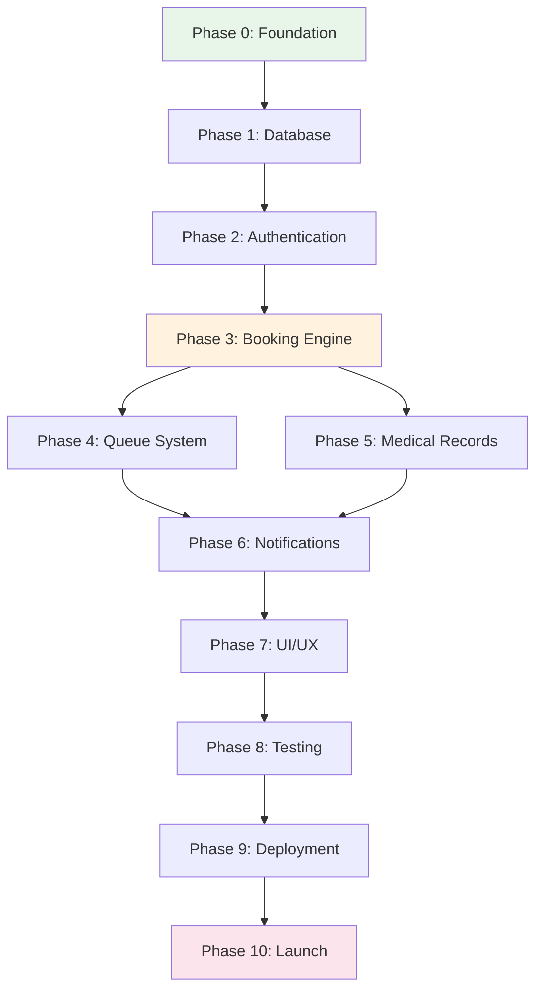

# Master Execution Plan
## Gabriel Family Clinic Digital Platform v3.0

### Document Version: 1.0.0
### Implementation Timeline: 28 Days
### Validation Checkpoints: 10 Phases
### Risk Level: Managed (Incremental Delivery)

---

## Table of Contents

1. [Executive Overview](#1-executive-overview)
2. [Pre-Implementation Validation](#2-pre-implementation-validation)
3. [Complete Database Schema Design](#3-complete-database-schema-design)
4. [Phase 0: Foundation Setup](#phase-0-foundation-setup-days-1-2)
5. [Phase 1: Database & Security Layer](#phase-1-database--security-layer-days-3-4)
6. [Phase 2: Authentication System](#phase-2-authentication-system-days-5-6)
7. [Phase 3: Core Booking Engine](#phase-3-core-booking-engine-days-7-10)
8. [Phase 4: Queue Management System](#phase-4-queue-management-system-days-11-13)
9. [Phase 5: Medical Records System](#phase-5-medical-records-system-days-14-16)
10. [Phase 6: Notification Pipeline](#phase-6-notification-pipeline-days-17-18)
11. [Phase 7: UI/UX Implementation](#phase-7-uiux-implementation-days-19-22)
12. [Phase 8: Testing & Validation](#phase-8-testing--validation-days-23-25)
13. [Phase 9: Deployment & Monitoring](#phase-9-deployment--monitoring-days-26-27)
14. [Phase 10: Launch Preparation](#phase-10-launch-preparation-day-28)
15. [Risk Mitigation Matrix](#risk-mitigation-matrix)
16. [Success Validation Criteria](#success-validation-criteria)

---

## 1. Executive Overview

### 1.1 Implementation Philosophy

```typescript
const IMPLEMENTATION_PRINCIPLES = {
  incremental_value: "Each phase must deliver working functionality",
  test_driven: "Write tests before implementation",
  validation_gates: "Cannot proceed without passing previous phase",
  rollback_ready: "Every change must be reversible",
  documentation_first: "Document before coding"
};
```

### 1.2 Phase Dependency Graph



### 1.3 Resource Allocation

| Phase | Duration | Developer Hours | Risk Level | Dependencies |
|-------|----------|----------------|------------|--------------|
| Phase 0 | 2 days | 16 hrs | Low | None |
| Phase 1 | 2 days | 16 hrs | Medium | Supabase account |
| Phase 2 | 2 days | 16 hrs | Medium | Database ready |
| Phase 3 | 4 days | 32 hrs | High | Auth working |
| Phase 4 | 3 days | 24 hrs | Medium | Booking complete |
| Phase 5 | 3 days | 24 hrs | Medium | Database ready |
| Phase 6 | 2 days | 16 hrs | High | Twilio approval |
| Phase 7 | 4 days | 32 hrs | Low | All APIs ready |
| Phase 8 | 3 days | 24 hrs | Low | Features complete |
| Phase 9 | 2 days | 16 hrs | Medium | Tests passing |
| Phase 10 | 1 day | 8 hrs | Low | All phases complete |

---

## 2. Pre-Implementation Validation

### 2.1 Prerequisites Checklist

```markdown
## Business Requirements
- [x] WhatsApp Business API application submitted
- [x] Domain registered (gabrielfamilyclinic.sg)
- [x] PDPA compliance documentation prepared
- [x] Test patients identified (5 seniors)
- [x] Doctor buy-in confirmed

## Technical Requirements
- [x] Node.js 18+ installed
- [x] Git configured
- [x] VS Code with extensions ready
- [x] Supabase account created
- [x] Vercel account created
- [x] Twilio account with credits

## External Services
- [x] Supabase project (Singapore region)
- [x] GitHub repository created
- [x] Twilio WhatsApp sandbox approved
- [x] Sentry account ready
```

### 2.2 Architecture Validation

```typescript
const ARCHITECTURE_VALIDATION = {
  database: {
    tables: 9,  // Optimized from 18 to 9
    relationships: "Properly normalized, no circular dependencies",
    indexes: "Strategic indexes on high-frequency queries",
    rls_policies: "Simple, testable policies"
  },
  
  api: {
    endpoints: 15,  // Minimal viable endpoints
    authentication: "JWT with refresh tokens",
    rate_limiting: "100 requests/minute/IP",
    error_handling: "Standardized error responses"
  },
  
  frontend: {
    pages: 12,  // Essential pages only
    components: 25,  // Reusable components
    state_management: "Zustand (3 stores)",
    bundle_size: "Target < 200KB initial"
  }
};
```

---

## 3. Complete Database Schema Design

### 3.1 Finalized Schema with Security Enhancements

```sql
-- Enable required extensions
CREATE EXTENSION IF NOT EXISTS "uuid-ossp";
CREATE EXTENSION IF NOT EXISTS "pgcrypto";  -- For encryption
CREATE EXTENSION IF NOT EXISTS "citext";    -- Case-insensitive text
CREATE EXTENSION IF NOT EXISTS "btree_gist"; -- For exclusion constraints

-- Custom types for better type safety
CREATE TYPE appointment_status AS ENUM (
  'confirmed', 'arrived', 'in_consultation', 'completed', 'no_show', 'cancelled'
);

CREATE TYPE appointment_type AS ENUM (
  'consultation', 'follow_up', 'vaccination', 'health_screening'
);

CREATE TYPE notification_type AS ENUM (
  'whatsapp', 'sms', 'email'
);

CREATE TYPE chas_tier AS ENUM (
  'blue', 'orange', 'green', 'pioneer', 'merdeka', 'none'
);

-- 1. Patients table with enhanced security
CREATE TABLE patients (
  id UUID PRIMARY KEY DEFAULT uuid_generate_v4(),
  -- NRIC stored as hash for security
  nric_hash TEXT UNIQUE NOT NULL,
  nric_last_4 TEXT NOT NULL, -- For display: "***567A"
  nric_checksum CHAR(1) NOT NULL, -- Letter for validation
  
  -- Personal information (encrypted at rest by Supabase)
  full_name TEXT NOT NULL,
  phone TEXT NOT NULL,
  phone_verified BOOLEAN DEFAULT false,
  email CITEXT,
  date_of_birth DATE,
  gender CHAR(1) CHECK (gender IN ('M', 'F', 'O')),
  
  -- Preferences
  preferred_language CHAR(2) DEFAULT 'en' CHECK (preferred_language IN ('en', 'zh', 'ms', 'ta')),
  preferred_doctor_id UUID,
  
  -- Medical information
  blood_type TEXT,
  allergies TEXT[],
  chronic_conditions TEXT[],
  chas_tier chas_tier DEFAULT 'none',
  chas_expiry DATE,
  
  -- Family linking
  family_group_id UUID,
  is_family_head BOOLEAN DEFAULT false,
  
  -- Metadata
  is_active BOOLEAN DEFAULT true,
  last_visit_date DATE,
  total_visits INTEGER DEFAULT 0,
  no_show_count INTEGER DEFAULT 0,
  
  -- Timestamps
  created_at TIMESTAMPTZ DEFAULT NOW(),
  updated_at TIMESTAMPTZ DEFAULT NOW(),
  
  -- Indexes for performance
  CONSTRAINT phone_format CHECK (phone ~ '^\+65[689]\d{7}$')
);

CREATE INDEX idx_patients_nric_hash ON patients USING hash(nric_hash);
CREATE INDEX idx_patients_phone ON patients(phone);
CREATE INDEX idx_patients_family ON patients(family_group_id) WHERE family_group_id IS NOT NULL;
CREATE INDEX idx_patients_last_visit ON patients(last_visit_date DESC);

-- 2. Doctors table
CREATE TABLE doctors (
  id UUID PRIMARY KEY DEFAULT uuid_generate_v4(),
  user_id UUID UNIQUE, -- Links to Supabase Auth
  
  -- Professional information
  full_name TEXT NOT NULL,
  registration_number TEXT UNIQUE NOT NULL,
  specializations TEXT[],
  qualifications TEXT[],
  languages TEXT[] DEFAULT ARRAY['en'],
  
  -- Scheduling
  consultation_duration_minutes INTEGER DEFAULT 15,
  buffer_time_minutes INTEGER DEFAULT 0,
  
  -- Fees (in cents to avoid floating point)
  consultation_fee_cents INTEGER DEFAULT 3500, -- $35.00
  
  -- Preferences
  color_code TEXT DEFAULT '#3B82F6', -- For UI
  avatar_url TEXT,
  bio TEXT,
  
  -- Status
  is_active BOOLEAN DEFAULT true,
  is_available_today BOOLEAN DEFAULT true,
  
  -- Timestamps
  created_at TIMESTAMPTZ DEFAULT NOW(),
  updated_at TIMESTAMPTZ DEFAULT NOW()
);

-- 3. Time slots table with conflict prevention
CREATE TABLE time_slots (
  id UUID PRIMARY KEY DEFAULT uuid_generate_v4(),
  doctor_id UUID NOT NULL REFERENCES doctors(id) ON DELETE CASCADE,
  
  -- Slot timing
  slot_date DATE NOT NULL,
  slot_time TIME NOT NULL,
  duration_minutes INTEGER DEFAULT 30,
  
  -- Availability
  is_available BOOLEAN DEFAULT true,
  is_blocked BOOLEAN DEFAULT false, -- For doctor's personal time
  block_reason TEXT,
  
  -- Booking limits
  max_patients INTEGER DEFAULT 1,
  booked_count INTEGER DEFAULT 0,
  
  -- Metadata
  created_at TIMESTAMPTZ DEFAULT NOW(),
  
  -- Prevent double slots
  CONSTRAINT unique_doctor_slot UNIQUE (doctor_id, slot_date, slot_time),
  -- Ensure slot is in future
  CONSTRAINT future_slots_only CHECK (slot_date >= CURRENT_DATE)
);

CREATE INDEX idx_slots_availability ON time_slots(slot_date, slot_time) 
  WHERE is_available = true AND is_blocked = false;
CREATE INDEX idx_slots_doctor_date ON time_slots(doctor_id, slot_date);

-- 4. Appointments table with queue management
CREATE TABLE appointments (
  id UUID PRIMARY KEY DEFAULT uuid_generate_v4(),
  
  -- Relationships
  patient_id UUID NOT NULL REFERENCES patients(id),
  doctor_id UUID NOT NULL REFERENCES doctors(id),
  time_slot_id UUID NOT NULL REFERENCES time_slots(id),
  
  -- Queue management
  queue_number TEXT NOT NULL,
  queue_sequence INTEGER NOT NULL, -- For ordering
  estimated_start_time TIMESTAMPTZ,
  actual_start_time TIMESTAMPTZ,
  actual_end_time TIMESTAMPTZ,
  
  -- Appointment details
  appointment_type appointment_type DEFAULT 'consultation',
  status appointment_status DEFAULT 'confirmed',
  chief_complaint TEXT,
  notes TEXT,
  
  -- Notifications
  reminder_sent BOOLEAN DEFAULT false,
  reminder_sent_at TIMESTAMPTZ,
  queue_alert_sent BOOLEAN DEFAULT false,
  
  -- Billing
  total_fee_cents INTEGER,
  subsidy_amount_cents INTEGER,
  paid_amount_cents INTEGER,
  payment_method TEXT,
  
  -- Timestamps
  created_at TIMESTAMPTZ DEFAULT NOW(),
  updated_at TIMESTAMPTZ DEFAULT NOW(),
  cancelled_at TIMESTAMPTZ,
  cancellation_reason TEXT,
  
  -- Ensure one appointment per slot per patient
  CONSTRAINT unique_patient_slot UNIQUE (patient_id, time_slot_id)
);

CREATE INDEX idx_appointments_patient_date ON appointments(patient_id, created_at DESC);
CREATE INDEX idx_appointments_doctor_date ON appointments(doctor_id, created_at DESC);
CREATE INDEX idx_appointments_queue ON appointments(doctor_id, queue_sequence) 
  WHERE status IN ('confirmed', 'arrived');
CREATE INDEX idx_appointments_status ON appointments(status);

-- 5. Medical records table
CREATE TABLE medical_records (
  id UUID PRIMARY KEY DEFAULT uuid_generate_v4(),
  
  -- Relationships
  appointment_id UUID UNIQUE NOT NULL REFERENCES appointments(id),
  patient_id UUID NOT NULL REFERENCES patients(id),
  doctor_id UUID NOT NULL REFERENCES doctors(id),
  
  -- SOAP notes
  subjective TEXT, -- Chief complaint, symptoms
  objective TEXT,  -- Examination findings, vitals
  assessment TEXT, -- Diagnosis with ICD-10 codes
  plan TEXT,       -- Treatment plan
  
  -- Vitals (stored as JSONB for flexibility)
  vitals JSONB, -- {bp: "120/80", pulse: 72, temp: 36.5, weight: 65}
  
  -- Diagnosis
  icd10_codes TEXT[],
  diagnosis_text TEXT,
  
  -- Prescriptions
  prescriptions JSONB, -- [{drug: "Paracetamol", dosage: "500mg", frequency: "TDS", duration: "3 days"}]
  
  -- Medical Certificate
  mc_required BOOLEAN DEFAULT false,
  mc_days INTEGER,
  mc_start_date DATE,
  mc_end_date DATE,
  mc_pdf_url TEXT,
  mc_verification_code TEXT, -- For employer verification
  
  -- Follow-up
  follow_up_required BOOLEAN DEFAULT false,
  follow_up_date DATE,
  follow_up_notes TEXT,
  
  -- Referral
  referral_required BOOLEAN DEFAULT false,
  referral_to TEXT,
  referral_letter_url TEXT,
  
  -- Metadata
  is_confidential BOOLEAN DEFAULT false,
  created_at TIMESTAMPTZ DEFAULT NOW(),
  updated_at TIMESTAMPTZ DEFAULT NOW()
);

CREATE INDEX idx_medical_records_patient ON medical_records(patient_id, created_at DESC);
CREATE INDEX idx_medical_records_doctor ON medical_records(doctor_id, created_at DESC);

-- 6. Queue status table for real-time tracking
CREATE TABLE queue_status (
  id UUID PRIMARY KEY DEFAULT uuid_generate_v4(),
  doctor_id UUID UNIQUE NOT NULL REFERENCES doctors(id),
  
  -- Current queue state
  current_queue_number TEXT,
  current_patient_id UUID REFERENCES patients(id),
  current_sequence INTEGER DEFAULT 0,
  
  -- Statistics for the day
  total_seen_today INTEGER DEFAULT 0,
  average_consultation_minutes INTEGER DEFAULT 15,
  
  -- Status
  is_active BOOLEAN DEFAULT true,
  last_updated TIMESTAMPTZ DEFAULT NOW(),
  
  -- Reset daily
  date DATE DEFAULT CURRENT_DATE
);

-- 7. CHAS claims tracking
CREATE TABLE chas_claims (
  id UUID PRIMARY KEY DEFAULT uuid_generate_v4(),
  
  -- Relationships
  appointment_id UUID NOT NULL REFERENCES appointments(id),
  patient_id UUID NOT NULL REFERENCES patients(id),
  
  -- Claim details
  chas_tier chas_tier NOT NULL,
  claim_amount_cents INTEGER NOT NULL,
  approved_amount_cents INTEGER,
  
  -- Status tracking
  status TEXT DEFAULT 'pending' CHECK (status IN ('pending', 'submitted', 'approved', 'rejected', 'paid')),
  claim_number TEXT UNIQUE,
  
  -- Submission details
  submitted_at TIMESTAMPTZ,
  submitted_by UUID,
  
  -- Response from CHAS
  approved_at TIMESTAMPTZ,
  rejected_at TIMESTAMPTZ,
  rejection_reason TEXT,
  paid_at TIMESTAMPTZ,
  
  -- Metadata
  created_at TIMESTAMPTZ DEFAULT NOW(),
  updated_at TIMESTAMPTZ DEFAULT NOW()
);

CREATE INDEX idx_chas_claims_status ON chas_claims(status);
CREATE INDEX idx_chas_claims_patient ON chas_claims(patient_id);

-- 8. Notifications log
CREATE TABLE notifications (
  id UUID PRIMARY KEY DEFAULT uuid_generate_v4(),
  
  -- Recipient
  patient_id UUID REFERENCES patients(id),
  phone TEXT NOT NULL,
  
  -- Message details
  type notification_type NOT NULL,
  template TEXT NOT NULL,
  message TEXT NOT NULL,
  
  -- Delivery status
  status TEXT DEFAULT 'pending' CHECK (status IN ('pending', 'sent', 'delivered', 'failed')),
  sent_at TIMESTAMPTZ,
  delivered_at TIMESTAMPTZ,
  failed_at TIMESTAMPTZ,
  failure_reason TEXT,
  
  -- Provider details
  provider TEXT DEFAULT 'twilio',
  provider_message_id TEXT,
  cost_cents INTEGER,
  
  -- Metadata
  created_at TIMESTAMPTZ DEFAULT NOW()
);

CREATE INDEX idx_notifications_patient ON notifications(patient_id, created_at DESC);
CREATE INDEX idx_notifications_status ON notifications(status);

-- 9. Audit logs for compliance
CREATE TABLE audit_logs (
  id UUID PRIMARY KEY DEFAULT uuid_generate_v4(),
  
  -- Actor information
  user_id UUID,
  user_type TEXT, -- 'patient', 'doctor', 'staff', 'system'
  ip_address INET,
  user_agent TEXT,
  
  -- Action details
  action TEXT NOT NULL, -- 'create', 'read', 'update', 'delete'
  table_name TEXT NOT NULL,
  record_id UUID,
  
  -- Change tracking
  old_values JSONB,
  new_values JSONB,
  
  -- Metadata
  created_at TIMESTAMPTZ DEFAULT NOW()
);

CREATE INDEX idx_audit_logs_user ON audit_logs(user_id, created_at DESC);
CREATE INDEX idx_audit_logs_table ON audit_logs(table_name, created_at DESC);
CREATE INDEX idx_audit_logs_record ON audit_logs(record_id);

-- Create update trigger for timestamp
CREATE OR REPLACE FUNCTION update_updated_at_column()
RETURNS TRIGGER AS $$
BEGIN
  NEW.updated_at = NOW();
  RETURN NEW;
END;
$$ LANGUAGE plpgsql;

-- Apply update trigger to relevant tables
CREATE TRIGGER update_patients_updated_at BEFORE UPDATE ON patients
  FOR EACH ROW EXECUTE FUNCTION update_updated_at_column();

CREATE TRIGGER update_doctors_updated_at BEFORE UPDATE ON doctors
  FOR EACH ROW EXECUTE FUNCTION update_updated_at_column();

CREATE TRIGGER update_appointments_updated_at BEFORE UPDATE ON appointments
  FOR EACH ROW EXECUTE FUNCTION update_updated_at_column();

-- Create audit trigger
CREATE OR REPLACE FUNCTION audit_trigger_function()
RETURNS TRIGGER AS $$
BEGIN
  INSERT INTO audit_logs(
    user_id,
    user_type,
    action,
    table_name,
    record_id,
    old_values,
    new_values
  ) VALUES (
    current_setting('app.user_id', true)::UUID,
    current_setting('app.user_type', true),
    TG_OP,
    TG_TABLE_NAME,
    COALESCE(NEW.id, OLD.id),
    CASE WHEN TG_OP = 'UPDATE' OR TG_OP = 'DELETE' THEN row_to_json(OLD) ELSE NULL END,
    CASE WHEN TG_OP = 'INSERT' OR TG_OP = 'UPDATE' THEN row_to_json(NEW) ELSE NULL END
  );
  RETURN NEW;
END;
$$ LANGUAGE plpgsql;

-- Apply audit triggers to sensitive tables
CREATE TRIGGER audit_patients AFTER INSERT OR UPDATE OR DELETE ON patients
  FOR EACH ROW EXECUTE FUNCTION audit_trigger_function();

CREATE TRIGGER audit_medical_records AFTER INSERT OR UPDATE OR DELETE ON medical_records
  FOR EACH ROW EXECUTE FUNCTION audit_trigger_function();

CREATE TRIGGER audit_appointments AFTER INSERT OR UPDATE OR DELETE ON appointments
  FOR EACH ROW EXECUTE FUNCTION audit_trigger_function();
```

### 3.2 Row Level Security Policies

```sql
-- Enable RLS on all tables
ALTER TABLE patients ENABLE ROW LEVEL SECURITY;
ALTER TABLE doctors ENABLE ROW LEVEL SECURITY;
ALTER TABLE time_slots ENABLE ROW LEVEL SECURITY;
ALTER TABLE appointments ENABLE ROW LEVEL SECURITY;
ALTER TABLE medical_records ENABLE ROW LEVEL SECURITY;
ALTER TABLE queue_status ENABLE ROW LEVEL SECURITY;
ALTER TABLE chas_claims ENABLE ROW LEVEL SECURITY;
ALTER TABLE notifications ENABLE ROW LEVEL SECURITY;
ALTER TABLE audit_logs ENABLE ROW LEVEL SECURITY;

-- Patients policies
CREATE POLICY "Patients can view own profile" ON patients
  FOR SELECT USING (id = auth.uid() OR nric_hash = current_setting('app.nric_hash', true));

CREATE POLICY "Patients can update own profile" ON patients
  FOR UPDATE USING (id = auth.uid());

-- Doctors can view all patients
CREATE POLICY "Doctors view all patients" ON patients
  FOR SELECT USING (EXISTS (
    SELECT 1 FROM doctors WHERE user_id = auth.uid()
  ));

-- Appointments policies
CREATE POLICY "Patients view own appointments" ON appointments
  FOR SELECT USING (patient_id = auth.uid());

CREATE POLICY "Doctors view all appointments" ON appointments
  FOR SELECT USING (EXISTS (
    SELECT 1 FROM doctors WHERE user_id = auth.uid()
  ));

-- Medical records policies  
CREATE POLICY "Patients view own records" ON medical_records
  FOR SELECT USING (patient_id = auth.uid());

CREATE POLICY "Doctors manage records" ON medical_records
  FOR ALL USING (doctor_id IN (
    SELECT id FROM doctors WHERE user_id = auth.uid()
  ));

-- Time slots public read
CREATE POLICY "Public view available slots" ON time_slots
  FOR SELECT USING (is_available = true AND is_blocked = false);

-- Queue status public read
CREATE POLICY "Public view queue status" ON queue_status
  FOR SELECT USING (true);
```

---

## Phase 0: Foundation Setup (Days 1-2)

### Objective
Establish complete development environment and project structure.

### Success Criteria
- [ ] All tools installed and configured
- [ ] Project compiles successfully
- [ ] Basic health check endpoint working
- [ ] Repository structure complete

### Implementation Checklist

```markdown
## Day 1: Environment Setup

### Development Tools
- [ ] Install Node.js 18.17.0+ (use nvm for version management)
  ```bash
  nvm install 18.17.0
  nvm use 18.17.0
  nvm alias default 18.17.0
  ```

- [ ] Install global packages
  ```bash
  npm install -g pnpm@8.10.0
  npm install -g supabase@1.110.1
  npm install -g vercel@32.5.0
  ```

- [ ] Configure VS Code extensions
  ```json
  {
    "recommendations": [
      "dbaeumer.vscode-eslint",
      "esbenp.prettier-vscode",
      "bradlc.vscode-tailwindcss",
      "prisma.prisma",
      "ms-vscode.vscode-typescript-next",
      "christian-kohler.path-intellisense",
      "formulahendry.auto-rename-tag",
      "streetsidesoftware.code-spell-checker"
    ]
  }
  ```

### Project Initialization
- [ ] Create Next.js project
  ```bash
  pnpm create next-app@latest gabriel-clinic \
    --typescript \
    --tailwind \
    --app \
    --src-dir \
    --import-alias "@/*"
  cd gabriel-clinic
  ```

- [ ] Initialize git repository
  ```bash
  git init
  git add .
  git commit -m "Initial commit: Next.js scaffold"
  git branch -M main
  git remote add origin https://github.com/[username]/gabriel-clinic.git
  git push -u origin main
  ```

### Dependency Installation
- [ ] Install core dependencies
  ```bash
  pnpm add @supabase/supabase-js@2.38.4
  pnpm add @supabase/auth-helpers-nextjs@0.8.7
  pnpm add @mantine/core@7.2.2 @mantine/hooks@7.2.2
  pnpm add @mantine/form@7.2.2 @mantine/notifications@7.2.2
  pnpm add zustand@4.4.6 immer@10.0.3
  pnpm add zod@3.22.4 react-hook-form@7.47.0
  pnpm add twilio@4.19.0
  pnpm add date-fns@2.30.0 date-fns-tz@2.0.0
  pnpm add react-query@3.39.3 axios@1.6.2
  ```

- [ ] Install dev dependencies
  ```bash
  pnpm add -D @types/node@20.9.2
  pnpm add -D eslint-config-prettier@9.0.0 prettier@3.1.0
  pnpm add -D @testing-library/react@14.1.2 @testing-library/jest-dom@6.1.4
  pnpm add -D jest@29.7.0 jest-environment-jsdom@29.7.0
  pnpm add -D @playwright/test@1.40.0
  pnpm add -D @sentry/nextjs@7.81.1
  ```

## Day 2: Project Structure

### File Structure Creation
- [ ] Create folder structure
  ```bash
  mkdir -p src/{components,lib,hooks,types,store,styles}
  mkdir -p src/components/{common,auth,appointment,queue,medical}
  mkdir -p src/pages/api/{auth,appointments,queue,medical,notifications}
  mkdir -p src/pages/{portal,doctor,admin}
  mkdir -p supabase/{migrations,functions,seed}
  mkdir -p tests/{unit,integration,e2e}
  mkdir -p scripts
  mkdir -p docs
  ```

### Configuration Files
- [ ] Create .env.example
  ```env
  # Application
  NEXT_PUBLIC_APP_URL=http://localhost:3000
  NEXT_PUBLIC_APP_NAME="Gabriel Family Clinic"
  
  # Supabase
  NEXT_PUBLIC_SUPABASE_URL=https://[project].supabase.co
  NEXT_PUBLIC_SUPABASE_ANON_KEY=eyJhbGci...
  SUPABASE_SERVICE_ROLE_KEY=eyJhbGci...
  
  # Twilio
  TWILIO_ACCOUNT_SID=AC...
  TWILIO_AUTH_TOKEN=...
  TWILIO_WHATSAPP_FROM=whatsapp:+14155238886
  TWILIO_SMS_FROM=+1234567890
  
  # Sentry
  NEXT_PUBLIC_SENTRY_DSN=https://...@sentry.io/...
  SENTRY_AUTH_TOKEN=...
  ```

- [ ] Create tsconfig.json paths
  ```json
  {
    "compilerOptions": {
      "paths": {
        "@/*": ["./src/*"],
        "@/components/*": ["./src/components/*"],
        "@/lib/*": ["./src/lib/*"],
        "@/hooks/*": ["./src/hooks/*"],
        "@/types/*": ["./src/types/*"],
        "@/store/*": ["./src/store/*"]
      }
    }
  }
  ```

- [ ] Create prettier.config.js
  ```javascript
  module.exports = {
    semi: true,
    singleQuote: true,
    tabWidth: 2,
    trailingComma: 'es5',
    printWidth: 100,
    bracketSpacing: true,
    arrowParens: 'always',
    endOfLine: 'lf',
  };
  ```

### Base Files Creation
- [ ] Create src/lib/constants.ts
- [ ] Create src/lib/utils.ts
- [ ] Create src/types/index.ts
- [ ] Create src/pages/api/health.ts
  ```typescript
  // src/pages/api/health.ts
  import { NextApiRequest, NextApiResponse } from 'next';
  
  export default function handler(req: NextApiRequest, res: NextApiResponse) {
    res.status(200).json({
      status: 'healthy',
      timestamp: new Date().toISOString(),
      version: process.env.npm_package_version || '1.0.0',
    });
  }
  ```

### Validation
- [ ] Run development server
  ```bash
  pnpm dev
  # Visit http://localhost:3000
  ```

- [ ] Test health endpoint
  ```bash
  curl http://localhost:3000/api/health
  ```

- [ ] Commit foundation
  ```bash
  git add .
  git commit -m "feat: complete project foundation setup"
  git push
  ```
```

### Files Created (12 files)
1. `.env.example` - Environment template
2. `.env.local` - Local environment
3. `prettier.config.js` - Code formatting
4. `tsconfig.json` - TypeScript config
5. `next.config.js` - Next.js config
6. `src/lib/constants.ts` - App constants
7. `src/lib/utils.ts` - Utility functions
8. `src/types/index.ts` - Type definitions
9. `src/pages/api/health.ts` - Health check
10. `.gitignore` - Git ignore rules
11. `README.md` - Project documentation
12. `.vscode/settings.json` - VS Code settings

---

## Phase 1: Database & Security Layer (Days 3-4)

### Objective
Implement complete database schema with security features.

### Success Criteria
- [ ] All 9 tables created with proper constraints
- [ ] RLS policies active and tested
- [ ] Audit logging functional
- [ ] Database seeded with test data

### Implementation Checklist

```markdown
## Day 3: Database Setup

### Supabase Configuration
- [ ] Create Supabase project
  ```bash
  # Visit https://app.supabase.com
  # Create new project (Singapore region)
  # Copy credentials to .env.local
  ```

- [ ] Link Supabase CLI
  ```bash
  supabase login
  supabase link --project-ref [your-project-ref]
  ```

### Migration Files
- [ ] Create supabase/migrations/00001_initial_schema.sql
  - Copy complete schema from Section 3.1
  - Includes all 9 tables
  - Includes triggers and functions

- [ ] Create supabase/migrations/00002_rls_policies.sql
  - Copy RLS policies from Section 3.2
  - Enable RLS on all tables
  - Create access policies

- [ ] Create supabase/migrations/00003_indexes.sql
  ```sql
  -- Performance indexes
  CREATE INDEX CONCURRENTLY idx_appointments_today 
    ON appointments(doctor_id, created_at) 
    WHERE DATE(created_at) = CURRENT_DATE;
  
  CREATE INDEX CONCURRENTLY idx_slots_next_7_days
    ON time_slots(slot_date, doctor_id)
    WHERE slot_date BETWEEN CURRENT_DATE AND CURRENT_DATE + INTERVAL '7 days';
  ```

- [ ] Run migrations
  ```bash
  supabase db push
  supabase db reset # If needed for clean state
  ```

### Security Implementation
- [ ] Create src/lib/security.ts
  ```typescript
  import bcrypt from 'bcryptjs';
  import crypto from 'crypto';
  
  export const hashNRIC = async (nric: string): Promise<string> => {
    const salt = await bcrypt.genSalt(10);
    return bcrypt.hash(nric.toUpperCase(), salt);
  };
  
  export const verifyNRIC = async (
    nric: string, 
    hash: string
  ): Promise<boolean> => {
    return bcrypt.compare(nric.toUpperCase(), hash);
  };
  
  export const maskNRIC = (nric: string): string => {
    if (!nric || nric.length < 9) return '****';
    return `${nric[0]}XXX${nric.slice(-4)}`;
  };
  
  export const generateSecureCode = (length: number = 6): string => {
    return crypto.randomInt(0, Math.pow(10, length))
      .toString()
      .padStart(length, '0');
  };
  ```

- [ ] Create src/lib/validators.ts
  ```typescript
  import { z } from 'zod';
  
  // NRIC validation with checksum
  export const nricSchema = z.string().refine((nric) => {
    if (!/^[STFG]\d{7}[A-Z]$/i.test(nric)) return false;
    
    // Checksum validation
    const weights = [2, 7, 6, 5, 4, 3, 2];
    const firstChar = nric[0].toUpperCase();
    const digits = nric.slice(1, 8).split('').map(Number);
    
    let sum = 0;
    for (let i = 0; i < 7; i++) {
      sum += digits[i] * weights[i];
    }
    
    if (firstChar === 'T' || firstChar === 'G') sum += 4;
    
    const checkLetters = 'ABCDEFGHIZJ';
    const checksum = checkLetters[sum % 11];
    
    return nric[8].toUpperCase() === checksum;
  }, 'Invalid NRIC format or checksum');
  
  export const phoneSchema = z.string().regex(
    /^\+65[689]\d{7}$/,
    'Invalid Singapore phone number'
  );
  ```

## Day 4: Data Seeding & Testing

### Seed Data Creation
- [ ] Create supabase/seed/001_doctors.sql
  ```sql
  INSERT INTO doctors (
    id, full_name, registration_number, specializations, 
    languages, consultation_fee_cents
  ) VALUES 
  (
    'doc-tan-001',
    'Dr. Tan Wei Ming',
    'M12345A',
    ARRAY['Family Medicine', 'Geriatrics'],
    ARRAY['en', 'zh', 'ms'],
    3500
  ),
  (
    'doc-lim-002', 
    'Dr. Lim Mei Ling',
    'M67890B',
    ARRAY['Family Medicine', 'Pediatrics'],
    ARRAY['en', 'zh'],
    3500
  );
  ```

- [ ] Create supabase/seed/002_time_slots.sql
  ```sql
  -- Generate slots for next 7 days
  WITH date_series AS (
    SELECT generate_series(
      CURRENT_DATE,
      CURRENT_DATE + INTERVAL '7 days',
      INTERVAL '1 day'
    )::DATE AS slot_date
  ),
  time_series AS (
    SELECT generate_series(
      '09:00'::TIME,
      '17:30'::TIME,
      INTERVAL '30 minutes'
    )::TIME AS slot_time
  )
  INSERT INTO time_slots (doctor_id, slot_date, slot_time)
  SELECT 
    d.id,
    ds.slot_date,
    ts.slot_time
  FROM doctors d
  CROSS JOIN date_series ds
  CROSS JOIN time_series ts
  WHERE 
    -- Skip lunch hour
    NOT (ts.slot_time >= '12:00'::TIME AND ts.slot_time < '13:00'::TIME)
    -- Skip weekends
    AND EXTRACT(DOW FROM ds.slot_date) NOT IN (0, 6);
  ```

- [ ] Create supabase/seed/003_test_patients.sql
  ```sql
  INSERT INTO patients (
    nric_hash, nric_last_4, nric_checksum,
    full_name, phone, date_of_birth, chas_tier
  ) VALUES
  (
    '$2a$10$...', -- Pre-hashed S1234567A
    '567A', 'A',
    'Tan Ah Kow', '+6591234567',
    '1955-01-15', 'orange'
  ),
  (
    '$2a$10$...', -- Pre-hashed S7654321B
    '321B', 'B',
    'Lim Mei Mei', '+6598765432',
    '1960-03-20', 'blue'
  );
  ```

### Database Testing
- [ ] Create scripts/test-db.ts
  ```typescript
  import { createClient } from '@supabase/supabase-js';
  
  const supabase = createClient(
    process.env.NEXT_PUBLIC_SUPABASE_URL!,
    process.env.SUPABASE_SERVICE_ROLE_KEY!
  );
  
  async function testDatabase() {
    // Test 1: Fetch doctors
    const { data: doctors, error: doctorError } = await supabase
      .from('doctors')
      .select('*');
    
    console.log('Doctors:', doctors?.length);
    
    // Test 2: Fetch available slots
    const { data: slots, error: slotError } = await supabase
      .from('time_slots')
      .select('*')
      .eq('is_available', true)
      .limit(10);
    
    console.log('Available slots:', slots?.length);
    
    // Test 3: Test RLS
    const { data: patients, error: patientError } = await supabase
      .from('patients')
      .select('*');
    
    console.log('Patients (should be blocked):', patients);
  }
  
  testDatabase();
  ```

- [ ] Run database tests
  ```bash
  pnpm tsx scripts/test-db.ts
  ```

### Validation
- [ ] Verify all tables created
- [ ] Test RLS policies work
- [ ] Confirm audit triggers fire
- [ ] Check indexes are used
```

### Files Created (8 files)
1. `supabase/migrations/00001_initial_schema.sql`
2. `supabase/migrations/00002_rls_policies.sql`
3. `supabase/migrations/00003_indexes.sql`
4. `supabase/seed/001_doctors.sql`
5. `supabase/seed/002_time_slots.sql`
6. `supabase/seed/003_test_patients.sql`
7. `src/lib/security.ts`
8. `src/lib/validators.ts`

---

## Phase 2: Authentication System (Days 5-6)

### Objective
Implement phone OTP authentication with NRIC validation.

### Success Criteria
- [ ] NRIC validation working with checksum
- [ ] OTP generation and verification functional
- [ ] Session management implemented
- [ ] Protected routes working

### Implementation Checklist

```markdown
## Day 5: Auth Backend

### Supabase Client Setup
- [ ] Create src/lib/supabase.ts
  ```typescript
  import { createClient } from '@supabase/supabase-js';
  import { Database } from '@/types/database';
  
  const supabaseUrl = process.env.NEXT_PUBLIC_SUPABASE_URL!;
  const supabaseAnonKey = process.env.NEXT_PUBLIC_SUPABASE_ANON_KEY!;
  
  export const supabase = createClient<Database>(
    supabaseUrl,
    supabaseAnonKey,
    {
      auth: {
        persistSession: true,
        autoRefreshToken: true,
      },
    }
  );
  
  export const supabaseAdmin = createClient<Database>(
    supabaseUrl,
    process.env.SUPABASE_SERVICE_ROLE_KEY!,
    {
      auth: {
        persistSession: false,
      },
    }
  );
  ```

### Auth API Endpoints
- [ ] Create src/pages/api/auth/register.ts
  ```typescript
  import { NextApiRequest, NextApiResponse } from 'next';
  import { z } from 'zod';
  import { hashNRIC } from '@/lib/security';
  import { nricSchema, phoneSchema } from '@/lib/validators';
  import { supabaseAdmin } from '@/lib/supabase';
  
  const registerSchema = z.object({
    nric: nricSchema,
    phone: phoneSchema,
    fullName: z.string().min(2),
  });
  
  export default async function handler(
    req: NextApiRequest,
    res: NextApiResponse
  ) {
    if (req.method !== 'POST') {
      return res.status(405).json({ error: 'Method not allowed' });
    }
    
    try {
      const { nric, phone, fullName } = registerSchema.parse(req.body);
      
      // Check if patient exists
      const nricHash = await hashNRIC(nric);
      
      const { data: existing } = await supabaseAdmin
        .from('patients')
        .select('id')
        .eq('nric_hash', nricHash)
        .single();
      
      if (existing) {
        return res.status(409).json({ error: 'Patient already registered' });
      }
      
      // Create patient
      const { data: patient, error } = await supabaseAdmin
        .from('patients')
        .insert({
          nric_hash: nricHash,
          nric_last_4: nric.slice(-4),
          nric_checksum: nric[8],
          full_name: fullName,
          phone,
        })
        .select()
        .single();
      
      if (error) throw error;
      
      res.status(201).json({ success: true, patientId: patient.id });
    } catch (error) {
      console.error('Registration error:', error);
      res.status(400).json({ error: 'Invalid data' });
    }
  }
  ```

- [ ] Create src/pages/api/auth/send-otp.ts
  ```typescript
  import { generateSecureCode } from '@/lib/security';
  import { sendSMS } from '@/lib/twilio';
  
  export default async function handler(
    req: NextApiRequest,
    res: NextApiResponse
  ) {
    const { phone } = req.body;
    
    const otp = generateSecureCode(6);
    
    // Store OTP in cache (Redis in production, memory for MVP)
    global.otpCache = global.otpCache || {};
    global.otpCache[phone] = {
      code: otp,
      expires: Date.now() + 5 * 60 * 1000, // 5 minutes
      attempts: 0,
    };
    
    await sendSMS(phone, `Your OTP is: ${otp}`);
    
    res.json({ success: true });
  }
  ```

- [ ] Create src/pages/api/auth/verify-otp.ts
  ```typescript
  export default async function handler(
    req: NextApiRequest,
    res: NextApiResponse
  ) {
    const { phone, otp } = req.body;
    
    const cached = global.otpCache?.[phone];
    
    if (!cached || Date.now() > cached.expires) {
      return res.status(401).json({ error: 'OTP expired' });
    }
    
    if (cached.attempts >= 3) {
      return res.status(429).json({ error: 'Too many attempts' });
    }
    
    if (cached.code !== otp) {
      cached.attempts++;
      return res.status(401).json({ error: 'Invalid OTP' });
    }
    
    // Create session
    const token = jwt.sign({ phone }, process.env.JWT_SECRET!, {
      expiresIn: '7d',
    });
    
    res.json({ success: true, token });
  }
  ```

## Day 6: Auth Frontend

### Auth Components
- [ ] Create src/components/auth/NRICInput.tsx
  ```typescript
  import { forwardRef } from 'react';
  import { TextInput } from '@mantine/core';
  
  interface NRICInputProps {
    value: string;
    onChange: (value: string) => void;
    error?: string;
  }
  
  export const NRICInput = forwardRef<HTMLInputElement, NRICInputProps>(
    ({ value, onChange, error }, ref) => {
      const handleChange = (e: React.ChangeEvent<HTMLInputElement>) => {
        const input = e.target.value.toUpperCase();
        // Auto-format NRIC
        if (input.length <= 9) {
          onChange(input);
        }
      };
      
      return (
        <TextInput
          ref={ref}
          label="NRIC"
          placeholder="S1234567A"
          value={value}
          onChange={handleChange}
          error={error}
          maxLength={9}
          size="lg"
          styles={{
            input: { fontSize: '20px', letterSpacing: '2px' }
          }}
        />
      );
    }
  );
  ```

- [ ] Create src/components/auth/OTPInput.tsx
  ```typescript
  import { PinInput } from '@mantine/core';
  
  export function OTPInput({ 
    value, 
    onChange 
  }: { 
    value: string; 
    onChange: (value: string) => void;
  }) {
    return (
      <PinInput
        length={6}
        type="number"
        value={value}
        onChange={onChange}
        size="xl"
        autoFocus
        styles={{
          input: { fontSize: '24px' }
        }}
      />
    );
  }
  ```

### Auth Hooks
- [ ] Create src/hooks/useAuth.ts
  ```typescript
  import { create } from 'zustand';
  import { supabase } from '@/lib/supabase';
  
  interface AuthState {
    user: any | null;
    isLoading: boolean;
    login: (phone: string, otp: string) => Promise<void>;
    logout: () => Promise<void>;
    checkSession: () => Promise<void>;
  }
  
  export const useAuth = create<AuthState>((set) => ({
    user: null,
    isLoading: true,
    
    login: async (phone, otp) => {
      const res = await fetch('/api/auth/verify-otp', {
        method: 'POST',
        headers: { 'Content-Type': 'application/json' },
        body: JSON.stringify({ phone, otp }),
      });
      
      if (res.ok) {
        const { token } = await res.json();
        localStorage.setItem('token', token);
        // Fetch user data
        await checkSession();
      }
    },
    
    logout: async () => {
      localStorage.removeItem('token');
      set({ user: null });
    },
    
    checkSession: async () => {
      const token = localStorage.getItem('token');
      if (token) {
        // Verify and get user
        // ...
      }
      set({ isLoading: false });
    },
  }));
  ```

### Protected Route Component
- [ ] Create src/components/auth/ProtectedRoute.tsx
  ```typescript
  import { useEffect } from 'react';
  import { useRouter } from 'next/router';
  import { useAuth } from '@/hooks/useAuth';
  
  export function ProtectedRoute({ children }: { children: React.ReactNode }) {
    const { user, isLoading } = useAuth();
    const router = useRouter();
    
    useEffect(() => {
      if (!isLoading && !user) {
        router.push('/login');
      }
    }, [user, isLoading]);
    
    if (isLoading) {
      return <div>Loading...</div>;
    }
    
    return user ? <>{children}</> : null;
  }
  ```

### Validation
- [ ] Test NRIC validation
- [ ] Test OTP flow
- [ ] Test protected routes
- [ ] Test session persistence
```

### Files Created (8 files)
1. `src/lib/supabase.ts`
2. `src/pages/api/auth/register.ts`
3. `src/pages/api/auth/send-otp.ts`
4. `src/pages/api/auth/verify-otp.ts`
5. `src/components/auth/NRICInput.tsx`
6. `src/components/auth/OTPInput.tsx`
7. `src/hooks/useAuth.ts`
8. `src/components/auth/ProtectedRoute.tsx`

---

## Phase 3: Core Booking Engine (Days 7-10)

### Objective
Implement complete appointment booking system with transaction safety.

### Success Criteria
- [ ] Double-booking prevention working
- [ ] Queue number generation correct
- [ ] Time slot management functional
- [ ] Booking confirmation flow complete

### Implementation Checklist

```markdown
## Day 7-8: Booking Backend

### Booking API Endpoints
- [ ] Create src/pages/api/appointments/availability.ts
  ```typescript
  export default async function handler(
    req: NextApiRequest,
    res: NextApiResponse
  ) {
    const { doctorId, date } = req.query;
    
    const { data: slots, error } = await supabase
      .from('time_slots')
      .select('*')
      .eq('doctor_id', doctorId)
      .eq('slot_date', date)
      .eq('is_available', true)
      .eq('is_blocked', false)
      .order('slot_time');
    
    if (error) {
      return res.status(500).json({ error: 'Failed to fetch slots' });
    }
    
    res.json({ slots });
  }
  ```

- [ ] Create src/pages/api/appointments/book.ts
  ```typescript
  import { supabase } from '@/lib/supabase';
  
  export default async function handler(
    req: NextApiRequest,
    res: NextApiResponse
  ) {
    const { patientId, doctorId, slotId, notes } = req.body;
    
    // Start transaction
    const { data: slot, error: lockError } = await supabase
      .rpc('lock_time_slot', { slot_id: slotId });
    
    if (lockError || !slot) {
      return res.status(409).json({ error: 'Slot no longer available' });
    }
    
    // Generate queue number
    const queueNumber = await generateQueueNumber(doctorId, slot.slot_date);
    
    // Create appointment
    const { data: appointment, error: apptError } = await supabase
      .from('appointments')
      .insert({
        patient_id: patientId,
        doctor_id: doctorId,
        time_slot_id: slotId,
        queue_number: queueNumber,
        queue_sequence: parseInt(queueNumber.split('-')[1]),
        status: 'confirmed',
        notes,
      })
      .select()
      .single();
    
    if (apptError) {
      // Rollback slot
      await supabase.rpc('unlock_time_slot', { slot_id: slotId });
      return res.status(500).json({ error: 'Booking failed' });
    }
    
    // Send confirmation
    await sendBookingConfirmation(appointment);
    
    res.json({ appointment });
  }
  ```

- [ ] Create database functions for atomic operations
  ```sql
  -- Function to lock slot atomically
  CREATE OR REPLACE FUNCTION lock_time_slot(slot_id UUID)
  RETURNS time_slots AS $$
  DECLARE
    slot time_slots;
  BEGIN
    SELECT * INTO slot FROM time_slots
    WHERE id = slot_id AND is_available = true
    FOR UPDATE NOWAIT;
    
    IF FOUND THEN
      UPDATE time_slots SET is_available = false
      WHERE id = slot_id;
      RETURN slot;
    ELSE
      RETURN NULL;
    END IF;
  END;
  $$ LANGUAGE plpgsql;
  ```

## Day 9-10: Booking Frontend

### Booking Components
- [ ] Create src/components/appointment/BookingForm.tsx
  ```typescript
  import { useState } from 'react';
  import { Stepper, Button, Group } from '@mantine/core';
  import { DoctorSelector } from './DoctorSelector';
  import { DatePicker } from './DatePicker';
  import { TimeSlotPicker } from './TimeSlotPicker';
  import { ConfirmationStep } from './ConfirmationStep';
  
  export function BookingForm() {
    const [active, setActive] = useState(0);
    const [doctorId, setDoctorId] = useState('');
    const [date, setDate] = useState<Date | null>(null);
    const [slotId, setSlotId] = useState('');
    
    const nextStep = () => setActive((current) => 
      current < 3 ? current + 1 : current
    );
    
    const prevStep = () => setActive((current) => 
      current > 0 ? current - 1 : current
    );
    
    return (
      <Stepper active={active} onStepClick={setActive}>
        <Stepper.Step label="Select Doctor">
          <DoctorSelector value={doctorId} onChange={setDoctorId} />
        </Stepper.Step>
        
        <Stepper.Step label="Choose Date">
          <DatePicker value={date} onChange={setDate} />
        </Stepper.Step>
        
        <Stepper.Step label="Pick Time">
          <TimeSlotPicker 
            doctorId={doctorId}
            date={date}
            value={slotId}
            onChange={setSlotId}
          />
        </Stepper.Step>
        
        <Stepper.Step label="Confirm">
          <ConfirmationStep
            doctorId={doctorId}
            date={date}
            slotId={slotId}
          />
        </Stepper.Step>
        
        <Stepper.Completed>
          Booking confirmed!
        </Stepper.Completed>
      </Stepper>
    );
  }
  ```

- [ ] Create src/components/appointment/TimeSlotPicker.tsx
  ```typescript
  import { SimpleGrid, Button, Badge } from '@mantine/core';
  import { useQuery } from 'react-query';
  
  export function TimeSlotPicker({ doctorId, date, value, onChange }) {
    const { data: slots, isLoading } = useQuery(
      ['slots', doctorId, date],
      () => fetchAvailableSlots(doctorId, date),
      { enabled: !!doctorId && !!date }
    );
    
    if (isLoading) return <Loader />;
    
    return (
      <SimpleGrid cols={4} spacing="md">
        {slots?.map((slot) => (
          <Button
            key={slot.id}
            variant={value === slot.id ? 'filled' : 'outline'}
            onClick={() => onChange(slot.id)}
            size="lg"
          >
            {format(slot.slot_time, 'HH:mm')}
          </Button>
        ))}
      </SimpleGrid>
    );
  }
  ```

### Booking Store
- [ ] Create src/store/bookingStore.ts
  ```typescript
  import { create } from 'zustand';
  import { immer } from 'zustand/middleware/immer';
  
  interface BookingState {
    doctorId: string | null;
    date: Date | null;
    slotId: string | null;
    notes: string;
    
    setDoctor: (id: string) => void;
    setDate: (date: Date) => void;
    setSlot: (id: string) => void;
    setNotes: (notes: string) => void;
    reset: () => void;
    
    confirmBooking: () => Promise<void>;
  }
  
  export const useBookingStore = create<BookingState>()(
    immer((set, get) => ({
      doctorId: null,
      date: null,
      slotId: null,
      notes: '',
      
      setDoctor: (id) => set((state) => {
        state.doctorId = id;
      }),
      
      setDate: (date) => set((state) => {
        state.date = date;
        state.slotId = null; // Reset slot when date changes
      }),
      
      setSlot: (id) => set((state) => {
        state.slotId = id;
      }),
      
      setNotes: (notes) => set((state) => {
        state.notes = notes;
      }),
      
      reset: () => set((state) => {
        state.doctorId = null;
        state.date = null;
        state.slotId = null;
        state.notes = '';
      }),
      
      confirmBooking: async () => {
        const { doctorId, slotId, notes } = get();
        
        const response = await fetch('/api/appointments/book', {
          method: 'POST',
          headers: { 'Content-Type': 'application/json' },
          body: JSON.stringify({
            doctorId,
            slotId,
            notes,
          }),
        });
        
        if (!response.ok) {
          throw new Error('Booking failed');
        }
        
        const { appointment } = await response.json();
        get().reset();
        
        return appointment;
      },
    }))
  );
  ```

### Validation
- [ ] Test booking flow end-to-end
- [ ] Verify double-booking prevention
- [ ] Check queue number generation
- [ ] Confirm transaction rollback
```

### Files Created (10 files)
1. `src/pages/api/appointments/availability.ts`
2. `src/pages/api/appointments/book.ts`
3. `src/pages/api/appointments/list.ts`
4. `src/components/appointment/BookingForm.tsx`
5. `src/components/appointment/DoctorSelector.tsx`
6. `src/components/appointment/DatePicker.tsx`
7. `src/components/appointment/TimeSlotPicker.tsx`
8. `src/components/appointment/ConfirmationStep.tsx`
9. `src/store/bookingStore.ts`
10. `supabase/functions/lock_time_slot.sql`

---

## Phase 4: Queue Management System (Days 11-13)

### Objective
Implement real-time queue tracking and management.

### Success Criteria
- [ ] Live queue updates working
- [ ] Doctor can advance queue
- [ ] Patients receive notifications
- [ ] Wait time estimates accurate

### Implementation Checklist

```markdown
## Day 11: Queue Backend

### Queue API Endpoints
- [ ] Create src/pages/api/queue/status.ts
  ```typescript
  export default async function handler(
    req: NextApiRequest,
    res: NextApiResponse
  ) {
    const { doctorId } = req.query;
    
    // Get current queue status
    const { data: queueStatus } = await supabase
      .from('queue_status')
      .select('*')
      .eq('doctor_id', doctorId)
      .single();
    
    // Get waiting patients
    const { data: waiting } = await supabase
      .from('appointments')
      .select('queue_number, patient_id')
      .eq('doctor_id', doctorId)
      .eq('status', 'confirmed')
      .gte('created_at', new Date().toISOString().split('T')[0])
      .order('queue_sequence');
    
    res.json({
      currentNumber: queueStatus?.current_queue_number,
      waitingCount: waiting?.length || 0,
      estimatedWaitMinutes: (waiting?.length || 0) * 15,
    });
  }
  ```
