# Project Architecture Document
## Gabriel Family Clinic Digital Platform v3.0

### Document Version: 1.0.0
### Last Updated: November 2024
### Architecture Type: Monolithic Next.js with Supabase Backend
### Deployment Model: Serverless (Vercel + Supabase)

---

## Table of Contents

1. [Executive Summary](#1-executive-summary)
2. [System Architecture Overview](#2-system-architecture-overview)
3. [File Structure & Hierarchy](#3-file-structure--hierarchy)
4. [Application Logic Flow](#4-application-logic-flow)
5. [User & Module Interactions](#5-user--module-interactions)
6. [Database Architecture](#6-database-architecture)
7. [API Architecture](#7-api-architecture)
8. [Frontend Architecture](#8-frontend-architecture)
9. [Security Architecture](#9-security-architecture)
10. [Deployment Architecture](#10-deployment-architecture)
11. [Implementation Guide](#11-implementation-guide)

---

## 1. Executive Summary

### 1.1 Architecture Philosophy

```typescript
const ARCHITECTURE_PRINCIPLES = {
  simplicity: "Every file must justify its existence",
  maintainability: "One developer should understand everything in 1 hour",
  scalability: "Handle 1 clinic perfectly before considering 2",
  pragmatism: "Use Supabase native features, avoid custom code",
  user_focus: "If it doesn't help Mdm. Tan, don't build it"
};
```

### 1.2 Technology Stack Summary

| Layer | Technology | Files | Purpose |
|-------|------------|-------|---------|
| **Frontend** | Next.js 13 + React 18 | ~25 files | Patient & doctor portals |
| **API** | Next.js API Routes | ~10 files | REST endpoints |
| **Database** | Supabase PostgreSQL | 7 tables | Data persistence |
| **Auth** | Supabase Auth | 2 hooks | Phone OTP authentication |
| **Storage** | Supabase Storage | 1 bucket | MC PDFs |
| **Realtime** | Supabase Realtime | 1 subscription | Queue updates |
| **Notifications** | Twilio | 1 service | WhatsApp/SMS |
| **Monitoring** | Sentry + Vercel Analytics | 1 config | Error tracking |

### 1.3 Key Metrics

- **Total Files**: ~50 (vs. 200+ in enterprise systems)
- **Lines of Code**: ~1,500 (vs. 10,000+)
- **Dependencies**: 15 (vs. 50+)
- **Build Time**: <60 seconds
- **Deployment**: Single command (`git push`)

---

## 2. System Architecture Overview

### 2.1 High-Level Architecture


### 2.2 Request Flow Architecture


---

## 3. File Structure & Hierarchy

### 3.1 Complete Project Structure

```
gabriel-clinic-platform/
├── 📁 src/
│   ├── 📁 pages/                    # Next.js pages (routes)
│   │   ├── 📁 api/                  # API endpoints
│   │   │   ├── 📁 auth/
│   │   │   │   ├── 📄 register.ts   # Patient registration (NRIC validation)
│   │   │   │   ├── 📄 verify.ts     # Send OTP
│   │   │   │   └── 📄 confirm.ts    # Confirm OTP, create session
│   │   │   ├── 📁 appointments/
│   │   │   │   ├── 📄 book.ts       # Book appointment (transaction)
│   │   │   │   ├── 📄 cancel.ts     # Cancel appointment
│   │   │   │   ├── 📄 list.ts       # Get patient appointments
│   │   │   │   └── 📄 availability.ts # Get available slots
│   │   │   ├── 📁 queue/
│   │   │   │   ├── 📄 status.ts     # Get current queue
│   │   │   │   ├── 📄 next.ts       # Doctor advances queue
│   │   │   │   └── 📄 subscribe.ts  # Realtime subscription
│   │   │   ├── 📁 medical/
│   │   │   │   ├── 📄 records.ts    # CRUD medical records
│   │   │   │   ├── 📄 mc.ts         # Generate MC PDF
│   │   │   │   └── 📄 prescription.ts # Manage prescriptions
│   │   │   ├── 📁 notifications/
│   │   │   │   └── 📄 send.ts       # Send WhatsApp/SMS
│   │   │   └── 📄 health.ts         # Health check endpoint
│   │   │
│   │   ├── 📁 portal/                # Patient portal pages
│   │   │   ├── 📄 index.tsx         # Landing page
│   │   │   ├── 📄 register.tsx      # Registration form
│   │   │   ├── 📄 book.tsx          # Booking interface
│   │   │   ├── 📄 appointments.tsx  # View appointments
│   │   │   ├── 📄 records.tsx       # Medical history
│   │   │   └── 📄 profile.tsx       # Patient profile
│   │   │
│   │   ├── 📁 doctor/                # Doctor portal pages
│   │   │   ├── 📄 login.tsx         # Doctor login
│   │   │   ├── 📄 schedule.tsx      # Daily schedule
│   │   │   ├── 📄 queue.tsx         # Queue management
│   │   │   ├── 📄 consultation.tsx  # SOAP notes entry
│   │   │   └── 📄 reports.tsx       # Daily reports
│   │   │
│   │   ├── 📄 _app.tsx              # App wrapper (providers)
│   │   ├── 📄 _document.tsx         # HTML document
│   │   └── 📄 index.tsx              # Homepage redirect
│   │
│   ├── 📁 components/                # Reusable components
│   │   ├── 📁 common/
│   │   │   ├── 📄 Layout.tsx        # App layout wrapper
│   │   │   ├── 📄 Header.tsx        # Navigation header
│   │   │   ├── 📄 Footer.tsx        # Footer with clinic info
│   │   │   ├── 📄 LoadingSpinner.tsx # Loading states
│   │   │   └── 📄 ErrorBoundary.tsx # Error handling
│   │   │
│   │   ├── 📁 appointment/
│   │   │   ├── 📄 BookingForm.tsx   # Main booking form
│   │   │   ├── 📄 DoctorSelector.tsx # Doctor selection
│   │   │   ├── 📄 DatePicker.tsx    # Calendar component
│   │   │   ├── 📄 TimeSlotPicker.tsx # Time slot grid
│   │   │   └── 📄 ConfirmationModal.tsx # Booking confirmation
│   │   │
│   │   ├── 📁 queue/
│   │   │   ├── 📄 QueueDisplay.tsx  # Current queue number
│   │   │   ├── 📄 QueueCard.tsx     # Patient queue card
│   │   │   └── 📄 WaitTimeEstimate.tsx # Estimated wait
│   │   │
│   │   ├── 📁 medical/
│   │   │   ├── 📄 SOAPForm.tsx      # SOAP notes form
│   │   │   ├── 📄 MCGenerator.tsx   # MC generation UI
│   │   │   ├── 📄 PrescriptionForm.tsx # Prescription entry
│   │   │   └── 📄 RecordCard.tsx    # Medical record display
│   │   │
│   │   └── 📁 auth/
│   │       ├── 📄 NRICInput.tsx     # NRIC validation input
│   │       ├── 📄 OTPInput.tsx      # 6-digit OTP input
│   │       └── 📄 ProtectedRoute.tsx # Route protection HOC
│   │
│   ├── 📁 lib/                      # Core libraries
│   │   ├── 📄 supabase.ts          # Supabase client singleton
│   │   ├── 📄 twilio.ts            # Twilio client wrapper
│   │   ├── 📄 constants.ts         # App constants
│   │   ├── 📄 validators.ts        # Validation schemas (Zod)
│   │   ├── 📄 utils.ts             # Utility functions
│   │   └── 📄 errors.ts            # Error handling utilities
│   │
│   ├── 📁 hooks/                    # Custom React hooks
│   │   ├── 📄 useAuth.ts           # Authentication state
│   │   ├── 📄 useSupabase.ts       # Supabase queries
│   │   ├── 📄 useRealtime.ts       # Realtime subscriptions
│   │   ├── 📄 useNotification.ts   # Toast notifications
│   │   └── 📄 useMediaQuery.ts     # Responsive design
│   │
│   ├── 📁 types/                    # TypeScript definitions
│   │   ├── 📄 database.ts          # Database schema types
│   │   ├── 📄 api.ts               # API request/response types
│   │   ├── 📄 supabase.ts          # Generated Supabase types
│   │   └── 📄 index.ts             # Common types
│   │
│   ├── 📁 styles/                   # CSS modules
│   │   ├── 📄 globals.css          # Global styles
│   │   ├── 📄 variables.css        # CSS variables
│   │   └── 📁 components/          # Component styles
│   │
│   └── 📁 store/                    # Zustand state management
│       ├── 📄 authStore.ts         # Auth state
│       ├── 📄 appointmentStore.ts  # Appointment state
│       └── 📄 queueStore.ts        # Queue state
│
├── 📁 public/                       # Static assets
│   ├── 📁 images/
│   │   ├── 📄 logo.svg
│   │   ├── 📄 dr-tan.jpg
│   │   └── 📄 dr-lim.jpg
│   ├── 📄 favicon.ico
│   └── 📄 manifest.json            # PWA manifest
│
├── 📁 supabase/                    # Database files
│   ├── 📁 migrations/
│   │   ├── 📄 00001_initial_schema.sql
│   │   ├── 📄 00002_add_audit_logs.sql
│   │   └── 📄 00003_add_indexes.sql
│   ├── 📄 seed.sql                # Demo data
│   └── 📄 config.toml             # Supabase config
│
├── 📁 scripts/                     # Utility scripts
│   ├── 📄 generate-types.ts       # Generate TS from DB
│   ├── 📄 seed-data.ts           # Seed demo data
│   └── 📄 backup-db.ts           # Backup database
│
├── 📁 tests/                       # Test files
│   ├── 📁 unit/
│   │   └── 📄 validators.test.ts
│   ├── 📁 integration/
│   │   └── 📄 booking.test.ts
│   └── 📁 e2e/
│       └── 📄 patient-journey.spec.ts
│
├── 📁 docker/                      # Docker configs
│   ├── 📄 Dockerfile
│   └── 📄 docker-compose.yml
│
├── 📁 .github/                     # GitHub configs
│   └── 📁 workflows/
│       ├── 📄 ci.yml              # CI pipeline
│       └── 📄 deploy.yml          # Auto-deploy
│
├── 📄 .env.example                # Environment template
├── 📄 .env.local                  # Local environment
├── 📄 .gitignore
├── 📄 next.config.js              # Next.js config
├── 📄 package.json
├── 📄 tsconfig.json               # TypeScript config
├── 📄 README.md
└── 📄 PROJECT_ARCHITECTURE.md     # This document
```

### 3.2 Key File Descriptions

| File Path | Purpose | Lines | Priority |
|-----------|---------|--------|----------|
| **Core API Files** |
| `api/appointments/book.ts` | Handles appointment booking with transaction safety | 120 | 🔴 Critical |
| `api/auth/verify.ts` | NRIC validation and OTP sending | 80 | 🔴 Critical |
| `api/queue/status.ts` | Returns live queue status | 40 | 🔴 Critical |
| `api/medical/mc.ts` | Generates MC PDFs with QR codes | 100 | 🟡 Important |
| **Core Components** |
| `components/appointment/BookingForm.tsx` | Main booking interface | 150 | 🔴 Critical |
| `components/queue/QueueDisplay.tsx` | Live queue number display | 60 | 🔴 Critical |
| `components/auth/NRICInput.tsx` | NRIC validation component | 80 | 🔴 Critical |
| **Core Libraries** |
| `lib/supabase.ts` | Supabase client configuration | 20 | 🔴 Critical |
| `lib/twilio.ts` | WhatsApp/SMS sending wrapper | 40 | 🔴 Critical |
| `hooks/useAuth.ts` | Authentication state management | 60 | 🔴 Critical |
| **Database** |
| `migrations/00001_initial_schema.sql` | Core database structure | 200 | 🔴 Critical |

---

## 4. Application Logic Flow

### 4.1 Patient Booking Flow

```mermaid
flowchart TD
    Start([Patient Opens Website])
    
    Start --> CheckAuth{Authenticated?}
    
    CheckAuth -->|No| Register[Registration Page]
    CheckAuth -->|Yes| BookingPage[Booking Page]
    
    Register --> InputNRIC[Enter NRIC]
    InputNRIC --> ValidateNRIC{Valid NRIC?}
    ValidateNRIC -->|No| InputNRIC
    ValidateNRIC -->|Yes| CheckExisting{Existing Patient?}
    
    CheckExisting -->|Yes| SendOTP1[Send OTP to Phone]
    CheckExisting -->|No| InputPhone[Enter Phone Number]
    InputPhone --> SendOTP2[Send OTP to Phone]
    
    SendOTP1 --> EnterOTP[Enter 6-Digit OTP]
    SendOTP2 --> EnterOTP
    
    EnterOTP --> VerifyOTP{OTP Valid?}
    VerifyOTP -->|No| EnterOTP
    VerifyOTP -->|Yes| CreateSession[Create Session]
    
    CreateSession --> BookingPage
    
    BookingPage --> SelectDoctor[Select Doctor]
    SelectDoctor --> SelectDate[Select Date]
    SelectDate --> LoadSlots[Load Available Slots]
    LoadSlots --> SelectTime[Select Time Slot]
    SelectTime --> AddNotes[Add Notes<br/>(Optional)]
    AddNotes --> ConfirmBooking[Confirm Booking]
    
    ConfirmBooking --> BeginTx[(BEGIN Transaction)]
    BeginTx --> LockSlot[Lock Time Slot]
    LockSlot --> CheckAvailable{Still Available?}
    
    CheckAvailable -->|No| RollbackTx[(ROLLBACK)]
    RollbackTx --> ShowError[Show Error:<br/>Slot Taken]
    ShowError --> SelectTime
    
    CheckAvailable -->|Yes| CreateAppt[Create Appointment]
    CreateAppt --> GenQueue[Generate Queue Number]
    GenQueue --> CommitTx[(COMMIT)]
    
    CommitTx --> SendWhatsApp[Send WhatsApp<br/>Confirmation]
    SendWhatsApp --> ShowSuccess[Show Success:<br/>Queue Number]
    
    ShowSuccess --> End([Booking Complete])
    
    style Start fill:#e8f5e9
    style End fill:#e8f5e9
    style BeginTx fill:#fff3e0
    style CommitTx fill:#fff3e0
    style RollbackTx fill:#ffebee
    style SendWhatsApp fill:#e3f2fd
```

### 4.2 Doctor Consultation Flow


### 4.3 Real-time Queue Update Flow


---

## 5. User & Module Interactions

### 5.1 User Roles & Permissions Matrix

```mermaid
graph TB
    subgraph "User Roles"
        PATIENT[👤 Patient<br/>NRIC: S1234567A]
        DOCTOR[👨‍⚕️ Doctor<br/>Dr. Tan]
        STAFF[👩‍💼 Staff<br/>Receptionist]
        ADMIN[👨‍💼 Admin<br/>Clinic Owner]
        GUEST[👥 Guest<br/>Not Logged In]
    end
    
    subgraph "Core Modules"
        AUTH[🔐 Authentication<br/>Phone OTP]
        BOOKING[📅 Booking<br/>Appointment Slots]
        QUEUE[📊 Queue<br/>Live Status]
        MEDICAL[📄 Medical<br/>Records & MC]
        BILLING[💳 Billing<br/>CHAS & Payments]
        NOTIFY[📱 Notifications<br/>WhatsApp/SMS]
        REPORTS[📈 Reports<br/>Analytics]
    end
    
    %% Guest Access (Public)
    GUEST -.->|View Only| QUEUE
    GUEST -.->|Read| AUTH
    
    %% Patient Access
    PATIENT -->|Full Access| BOOKING
    PATIENT -->|View Own| MEDICAL
    PATIENT -->|View Own| BILLING
    PATIENT -->|Receive| NOTIFY
    PATIENT -->|View| QUEUE
    
    %% Doctor Access
    DOCTOR -->|Manage| QUEUE
    DOCTOR -->|Full Access| MEDICAL
    DOCTOR -->|View| BOOKING
    DOCTOR -->|Trigger| NOTIFY
    DOCTOR -->|View| REPORTS
    DOCTOR -->|View| BILLING
    
    %% Staff Access
    STAFF -->|Manage| BOOKING
    STAFF -->|Update| QUEUE
    STAFF -->|Process| BILLING
    STAFF -->|Send| NOTIFY
    STAFF -->|View| REPORTS
    
    %% Admin Access
    ADMIN -->|Full Access| REPORTS
    ADMIN -->|Configure| BOOKING
    ADMIN -->|Override| BILLING
    ADMIN -->|Audit| MEDICAL
    ADMIN -->|Monitor| QUEUE
    
    style PATIENT fill:#e3f2fd
    style DOCTOR fill:#fff3e0
    style BOOKING fill:#e8f5e9
    style MEDICAL fill:#fce4ec
    style QUEUE fill:#f3e5f5
```



### 5.2 Module Interaction Flow


---

## 6. Database Architecture

### 6.1 Entity Relationship Diagram


### 6.2 Database Access Patterns

```typescript
// Common query patterns optimized with indexes

const ACCESS_PATTERNS = {
  // Patient queries
  patient_authentication: {
    query: "SELECT * FROM patients WHERE nric_hash = $1",
    index: "idx_patients_nric_hash",
    frequency: "Very High"
  },
  
  patient_appointments: {
    query: `
      SELECT a.*, d.name as doctor_name 
      FROM appointments a
      JOIN doctors d ON a.doctor_id = d.id
      WHERE a.patient_id = $1
      ORDER BY a.created_at DESC
      LIMIT 10
    `,
    index: "idx_appointments_patient_created",
    frequency: "High"
  },
  
  // Booking queries
  available_slots: {
    query: `
      SELECT * FROM time_slots
      WHERE doctor_id = $1 
        AND slot_date = $2
        AND is_available = true
      ORDER BY slot_time
    `,
    index: "idx_slots_doctor_date_available",
    frequency: "Very High"
  },
  
  // Queue queries
  current_queue: {
    query: `
      SELECT current_queue_number 
      FROM queue_status 
      WHERE doctor_id = $1
    `,
    index: "PRIMARY KEY",
    frequency: "Very High (cached)"
  },
  
  // Doctor queries
  daily_schedule: {
    query: `
      SELECT a.*, p.full_name, p.phone
      FROM appointments a
      JOIN patients p ON a.patient_id = p.id
      WHERE a.doctor_id = $1
        AND DATE(a.created_at) = CURRENT_DATE
        AND a.status != 'cancelled'
      ORDER BY a.queue_number
    `,
    index: "idx_appointments_doctor_date",
    frequency: "High"
  }
};
```

---

## 7. API Architecture

### 7.1 RESTful Endpoints

```typescript
const API_ENDPOINTS = {
  // Authentication
  "POST /api/auth/register": {
    body: { nric: string, phone: string },
    response: { success: boolean, message: string },
    auth: false
  },
  
  "POST /api/auth/verify": {
    body: { nric: string },
    response: { exists: boolean, phone_masked: string },
    auth: false
  },
  
  "POST /api/auth/confirm": {
    body: { nric: string, otp: string },
    response: { token: string, patient: Patient },
    auth: false
  },
  
  // Appointments
  "GET /api/appointments": {
    query: { patient_id?: string, status?: string },
    response: { appointments: Appointment[] },
    auth: true
  },
  
  "POST /api/appointments/book": {
    body: {
      patient_nric: string,
      doctor_id: string,
      slot_date: string,
      slot_time: string,
      notes?: string
    },
    response: { appointment: Appointment },
    auth: true
  },
  
  "DELETE /api/appointments/:id": {
    params: { id: string },
    response: { success: boolean },
    auth: true
  },
  
  "GET /api/appointments/availability": {
    query: { doctor_id: string, date: string },
    response: { slots: TimeSlot[] },
    auth: false
  },
  
  // Queue Management
  "GET /api/queue/status": {
    query: { doctor_id?: string },
    response: { 
      current_number: string,
      waiting_count: number,
      estimated_wait_minutes: number
    },
    auth: false
  },
  
  "POST /api/queue/next": {
    body: { doctor_id: string },
    response: { 
      next_number: string,
      patient: Patient
    },
    auth: "doctor"
  },
  
  "GET /api/queue/subscribe": {
    query: { queue_number: string },
    response: "SSE stream",
    auth: false
  },
  
  // Medical Records
  "GET /api/medical/records/:patient_id": {
    params: { patient_id: string },
    response: { records: MedicalRecord[] },
    auth: true
  },
  
  "POST /api/medical/records": {
    body: {
      appointment_id: string,
      soap: SOAPNotes,
      medications?: Medication[],
      mc_days?: number
    },
    response: { record: MedicalRecord },
    auth: "doctor"
  },
  
  "POST /api/medical/mc": {
    body: {
      appointment_id: string,
      days: number,
      remarks?: string
    },
    response: { pdf_url: string },
    auth: "doctor"
  },
  
  // Notifications
  "POST /api/notifications/send": {
    body: {
      patient_id: string,
      type: "whatsapp" | "sms",
      message: string
    },
    response: { sent: boolean },
    auth: "staff"
  }
};
```

### 7.2 API Error Handling

```typescript
// Standardized error responses
const ERROR_RESPONSES = {
  // 4xx Client Errors
  400: {
    code: "BAD_REQUEST",
    example: {
      error: "Invalid NRIC format",
      field: "nric",
      received: "S123"
    }
  },
  
  401: {
    code: "UNAUTHORIZED",
    example: {
      error: "Please login to continue"
    }
  },
  
  403: {
    code: "FORBIDDEN",
    example: {
      error: "Only doctors can access medical records"
    }
  },
  
  404: {
    code: "NOT_FOUND",
    example: {
      error: "Appointment not found",
      id: "uuid-here"
    }
  },
  
  409: {
    code: "CONFLICT",
    example: {
      error: "Time slot no longer available",
      suggestion: "Please select another slot"
    }
  },
  
  429: {
    code: "RATE_LIMITED",
    example: {
      error: "Too many requests",
      retry_after: 60
    }
  },
  
  // 5xx Server Errors
  500: {
    code: "INTERNAL_ERROR",
    example: {
      error: "An unexpected error occurred",
      reference: "error-id-12345"
    }
  },
  
  503: {
    code: "SERVICE_UNAVAILABLE",
    example: {
      error: "Database maintenance in progress",
      retry_after: 300
    }
  }
};
```

---

## 8. Frontend Architecture

### 8.1 Component Hierarchy


### 8.2 State Management Architecture

```typescript
// Zustand stores - minimal and focused

// authStore.ts
interface AuthState {
  patient: Patient | null;
  doctor: Doctor | null;
  isAuthenticated: boolean;
  login: (credentials: LoginCredentials) => Promise<void>;
  logout: () => void;
  checkSession: () => Promise<void>;
}

// appointmentStore.ts  
interface AppointmentState {
  selectedDoctor: Doctor | null;
  selectedDate: Date | null;
  selectedSlot: TimeSlot | null;
  availableSlots: TimeSlot[];
  bookingStatus: 'idle' | 'loading' | 'success' | 'error';
  
  setDoctor: (doctor: Doctor) => void;
  setDate: (date: Date) => void;
  fetchSlots: (doctorId: string, date: Date) => Promise<void>;
  bookAppointment: () => Promise<Appointment>;
  resetBooking: () => void;
}

// queueStore.ts
interface QueueState {
  currentNumber: string;
  waitingCount: number;
  estimatedWaitMinutes: number;
  myQueueNumber: string | null;
  
  subscribeToQueue: (queueNumber: string) => void;
  unsubscribe: () => void;
  updateQueue: (data: QueueUpdate) => void;
}
```

### 8.3 Component Examples

```tsx
// Key component: BookingForm.tsx
export const BookingForm: React.FC = () => {
  const { patient } = useAuthStore();
  const { 
    selectedDoctor,
    selectedDate,
    selectedSlot,
    bookingStatus,
    setDoctor,
    setDate,
    bookAppointment
  } = useAppointmentStore();
  
  const handleSubmit = async (e: FormEvent) => {
    e.preventDefault();
    
    try {
      const appointment = await bookAppointment();
      
      // Send to confirmation page
      router.push({
        pathname: '/portal/confirmation',
        query: { 
          queueNumber: appointment.queue_number,
          time: appointment.slot_time
        }
      });
      
    } catch (error) {
      toast.error('Booking failed. Please try again.');
    }
  };
  
  return (
    <form onSubmit={handleSubmit} className={styles.bookingForm}>
      <DoctorSelector 
        value={selectedDoctor}
        onChange={setDoctor}
      />
      
      <DatePicker
        value={selectedDate}
        onChange={setDate}
        minDate={new Date()}
        maxDate={addDays(new Date(), 7)}
      />
      
      {selectedDate && selectedDoctor && (
        <TimeSlotPicker
          doctorId={selectedDoctor.id}
          date={selectedDate}
          value={selectedSlot}
          onChange={setSlot}
        />
      )}
      
      <Button
        type="submit"
        size="large"
        loading={bookingStatus === 'loading'}
        disabled={!selectedSlot}
      >
        Confirm Booking
      </Button>
    </form>
  );
};
```

---

## 9. Security Architecture

### 9.1 Security Layers


### 9.2 Security Implementation Checklist

```typescript
const SECURITY_CHECKLIST = {
  authentication: {
    phone_otp: "✅ 6-digit OTP, 3 attempts max",
    session_timeout: "✅ 30 minutes idle timeout", 
    jwt_rotation: "✅ Refresh token every 7 days",
    password_less: "✅ No passwords to leak"
  },
  
  authorization: {
    rls_enabled: "✅ All tables have RLS",
    role_based: "✅ patient, doctor, staff, admin",
    api_auth: "✅ Middleware checks on all routes",
    field_level: "⚠️ TODO: Hide sensitive fields"
  },
  
  data_protection: {
    nric_hashing: "✅ bcrypt with salt",
    field_encryption: "⚠️ TODO: Implement for phone",
    https_only: "✅ Enforced via Vercel",
    secure_cookies: "✅ httpOnly, sameSite=strict"
  },
  
  compliance: {
    pdpa_consent: "✅ Explicit consent on registration",
    data_retention: "✅ 7-year policy implemented",
    audit_trail: "✅ All data changes logged",
    data_export: "✅ Patient can download all data"
  },
  
  monitoring: {
    error_tracking: "✅ Sentry integration",
    security_alerts: "✅ Alert on 5+ failed logins",
    uptime_monitoring: "✅ Vercel Analytics",
    backup_testing: "⚠️ TODO: Monthly restore test"
  }
};
```

---

## 10. Deployment Architecture

### 10.1 CI/CD Pipeline


### 10.2 Environment Configuration

```bash
# .env.local (Development)
NEXT_PUBLIC_APP_URL=http://localhost:3000
NEXT_PUBLIC_SUPABASE_URL=https://xxxx.supabase.co
NEXT_PUBLIC_SUPABASE_ANON_KEY=eyJhbGciOiJIUzI1NiIsInR5cCI6IkpXVCJ9...
SUPABASE_SERVICE_KEY=eyJhbGciOiJIUzI1NiIsInR5cCI6IkpXVCJ9...
TWILIO_ACCOUNT_SID=ACxxxxxxxxxxxxxxxxxxxxxxxxxxxxxxxx
TWILIO_AUTH_TOKEN=xxxxxxxxxxxxxxxxxxxxxxxxxxxxxxxx
TWILIO_WHATSAPP_FROM=whatsapp:+14155238886
SENTRY_DSN=https://xxxx@sentry.io/xxxx
NEXT_PUBLIC_SENTRY_DSN=https://xxxx@sentry.io/xxxx

# .env.production (Production - Set in Vercel)
NEXT_PUBLIC_APP_URL=https://gabrielfamilyclinic.sg
# ... same structure, production values
```

### 10.3 Infrastructure as Code

```yaml
# vercel.json
{
  "framework": "nextjs",
  "buildCommand": "npm run build",
  "devCommand": "npm run dev",
  "installCommand": "npm install",
  "regions": ["sin1"],  # Singapore region
  "functions": {
    "pages/api/*.ts": {
      "maxDuration": 10  # 10 second timeout
    }
  },
  "headers": [
    {
      "source": "/(.*)",
      "headers": [
        {
          "key": "X-Content-Type-Options",
          "value": "nosniff"
        },
        {
          "key": "X-Frame-Options",
          "value": "DENY"
        },
        {
          "key": "X-XSS-Protection",
          "value": "1; mode=block"
        }
      ]
    }
  ]
}
```

---

## 11. Implementation Guide

### 11.1 Week 1 Implementation Checklist

```markdown
## Day 1-2: Project Setup & Configuration

### Environment Setup
- [ ] Install Node.js 18+ and npm
- [ ] Install VS Code with extensions
- [ ] Create GitHub repository
- [ ] Initialize Next.js project
  ```bash
  npx create-next-app@latest gabriel-clinic --typescript --tailwind --app
  cd gabriel-clinic
  ```

### Supabase Setup  
- [ ] Create Supabase project (Singapore region)
- [ ] Copy environment variables
- [ ] Install Supabase CLI
  ```bash
  npm install -g supabase
  supabase login
  supabase link --project-ref your-project-id
  ```

### Initial Dependencies
- [ ] Install core packages
  ```bash
  npm install @supabase/supabase-js @supabase/auth-helpers-nextjs
  npm install @mantine/core @mantine/hooks @mantine/notifications @mantine/form
  npm install zustand zod react-hook-form
  npm install twilio
  npm install --save-dev @types/node
  ```

## Day 3-4: Database Schema & Auth

### Database Migration
- [ ] Create migration files
- [ ] Run initial schema migration
  ```bash
  supabase db push
  ```
- [ ] Enable RLS on all tables via Supabase Dashboard
- [ ] Add audit log triggers
- [ ] Create indexes for performance

### Authentication Setup
- [ ] Configure Supabase Auth for phone OTP
- [ ] Create auth helper functions
- [ ] Implement NRIC validation
- [ ] Test OTP flow

### Security Implementation
- [ ] Add NRIC hashing function
- [ ] Implement field-level encryption
- [ ] Set up audit logging
- [ ] Configure CORS

## Day 5: Deployment Pipeline

### Vercel Setup
- [ ] Connect GitHub repo to Vercel
- [ ] Configure environment variables
- [ ] Set up custom domain
- [ ] Test preview deployment

### Monitoring Setup
- [ ] Configure Sentry
- [ ] Set up error alerts
- [ ] Configure Vercel Analytics
- [ ] Test error reporting
```

### 11.2 Critical Path Implementation Order


### 11.3 Code Generation Scripts

```bash
# Generate TypeScript types from database
npm run generate:types

# Seed demo data
npm run db:seed

# Generate API documentation
npm run docs:api

# Run all checks before commit
npm run pre-commit
```

### 11.4 Testing Strategy Implementation

```typescript
// Test file structure and coverage targets

const TEST_COVERAGE_TARGETS = {
  unit: {
    target: 70,
    files: [
      "lib/validators.ts",        // NRIC validation
      "lib/utils.ts",             // Utility functions
      "components/**/*.tsx",       // UI components
      "hooks/*.ts"                // Custom hooks
    ]
  },
  
  integration: {
    target: 80,
    files: [
      "pages/api/**/*.ts"         // API endpoints
    ]
  },
  
  e2e: {
    target: 100,  // Critical paths only
    scenarios: [
      "Patient books appointment",
      "Doctor completes consultation",
      "Queue number updates"
    ]
  }
};

// Example test: Booking API
describe('POST /api/appointments/book', () => {
  it('should prevent double booking', async () => {
    const slot = await createAvailableSlot();
    
    // First booking succeeds
    const res1 = await request(app)
      .post('/api/appointments/book')
      .send({ slot_id: slot.id, patient_nric: 'S1234567A' });
    expect(res1.status).toBe(201);
    
    // Second booking fails
    const res2 = await request(app)
      .post('/api/appointments/book')
      .send({ slot_id: slot.id, patient_nric: 'S7654321B' });
    expect(res2.status).toBe(409);
  });
});
```

---

## Conclusion

This architecture document provides a **complete blueprint** for implementing the Gabriel Family Clinic digital platform. The design prioritizes:

1. **Simplicity**: 50 files instead of 200+
2. **Maintainability**: One developer can understand and modify
3. **Scalability**: Handles one clinic perfectly, ready for growth
4. **Security**: PDPA compliant from day one
5. **User Focus**: Optimized for Mdm. Tan's journey

### Next Steps

1. **Immediate** (Today):
   - Apply for WhatsApp Business API
   - Set up Supabase project
   - Create GitHub repository

2. **Week 1**:
   - Implement core database and auth
   - Deploy basic booking flow

3. **Week 2-3**:
   - Complete all MVP features
   - Conduct senior user testing

4. **Week 4**:
   - Soft launch with 50 patients
   - Iterate based on feedback

**Remember**: Every line of code must help Mdm. Tan book her appointment. If it doesn't, don't write it.

---

*Document Version 1.0.0 - Designed for immediate implementation by a solo developer*
