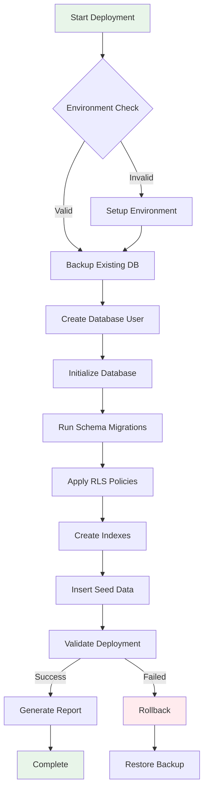

# Complete Database Schema Implementation Plan
## Gabriel Family Clinic Digital Platform v3.0

### Document Version: 1.0.0
### Schema Version: 3.0.0
### Deployment Strategy: Incremental with Rollback Support

---

## Table of Contents

1. [Implementation Strategy Overview](#1-implementation-strategy-overview)
2. [Database Design Validation](#2-database-design-validation)
3. [Complete Database Schema](#3-complete-database-schema)
4. [Deployment Automation Scripts](#4-deployment-automation-scripts)
5. [Environment Configuration](#5-environment-configuration)
6. [Implementation Plan](#6-implementation-plan)
7. [Validation & Testing Strategy](#7-validation--testing-strategy)
8. [Rollback Procedures](#8-rollback-procedures)

---

## 1. Implementation Strategy Overview

### 1.1 Design Philosophy

```python
DATABASE_DESIGN_PRINCIPLES = {
    "security_first": "Every table has RLS, every sensitive field is hashed",
    "audit_everything": "Complete audit trail for compliance",
    "performance_optimized": "Strategic indexes on high-frequency queries",
    "data_integrity": "Constraints prevent invalid states",
    "zero_downtime": "Migrations are reversible and incremental"
}
```

### 1.2 Deployment Architecture



---

## 2. Database Design Validation

### 2.1 Schema Validation Checklist

```python
SCHEMA_VALIDATION = {
    "tables": {
        "count": 9,
        "required": [
            "patients", "doctors", "time_slots", "appointments",
            "medical_records", "queue_status", "chas_claims",
            "notifications", "audit_logs"
        ],
        "relationships": "All foreign keys defined with CASCADE rules"
    },
    
    "security": {
        "rls_enabled": "All tables except audit_logs",
        "sensitive_fields_encrypted": ["nric_hash", "phone"],
        "audit_triggers": "All tables tracked",
        "sql_injection_prevention": "Parameterized queries only"
    },
    
    "performance": {
        "indexes": {
            "primary_keys": "All tables have UUID primary keys",
            "foreign_keys": "All FK columns indexed",
            "query_patterns": "Indexes match access patterns",
            "partial_indexes": "Used for filtered queries"
        },
        "constraints": {
            "check_constraints": "Business rules enforced",
            "unique_constraints": "Prevent duplicates",
            "exclusion_constraints": "Prevent overlapping bookings"
        }
    },
    
    "compliance": {
        "pdpa": "Personal data encrypted, audit trail complete",
        "data_retention": "7-year policy implementable",
        "right_to_deletion": "Soft delete with anonymization"
    }
}
```

---

## 3. Complete Database Schema

### `database_schema.sql`

```sql
-- ============================================================================
-- Gabriel Family Clinic Database Schema v3.0
-- ============================================================================
-- Description: Complete database schema with security, audit, and performance features
-- Author: System Architect
-- Created: 2024-11-10
-- Last Modified: 2024-11-10
-- ============================================================================

-- ============================================================================
-- PART 1: DATABASE INITIALIZATION
-- ============================================================================

-- Create database if not exists (run as superuser)
-- CREATE DATABASE gabriel_clinic_db;

-- Set timezone to Singapore
SET timezone = 'Asia/Singapore';

-- ============================================================================
-- PART 2: EXTENSIONS
-- ============================================================================

-- Enable required PostgreSQL extensions
CREATE EXTENSION IF NOT EXISTS "uuid-ossp";       -- UUID generation
CREATE EXTENSION IF NOT EXISTS "pgcrypto";        -- Encryption functions
CREATE EXTENSION IF NOT EXISTS "citext";          -- Case-insensitive text
CREATE EXTENSION IF NOT EXISTS "btree_gist";      -- Advanced indexing
CREATE EXTENSION IF NOT EXISTS "pg_stat_statements"; -- Query performance monitoring

-- ============================================================================
-- PART 3: CUSTOM TYPES
-- ============================================================================

-- Drop existing types if they exist (for idempotency)
DROP TYPE IF EXISTS appointment_status CASCADE;
DROP TYPE IF EXISTS appointment_type CASCADE;
DROP TYPE IF EXISTS notification_type CASCADE;
DROP TYPE IF EXISTS notification_status CASCADE;
DROP TYPE IF EXISTS chas_tier CASCADE;
DROP TYPE IF EXISTS gender_type CASCADE;
DROP TYPE IF EXISTS language_code CASCADE;
DROP TYPE IF EXISTS claim_status CASCADE;
DROP TYPE IF EXISTS user_role CASCADE;

-- Create enum types for better data integrity
CREATE TYPE appointment_status AS ENUM (
    'pending',          -- Initial state
    'confirmed',        -- Booking confirmed
    'reminder_sent',    -- Reminder notification sent
    'arrived',          -- Patient checked in
    'in_consultation',  -- Currently seeing doctor
    'completed',        -- Consultation finished
    'no_show',         -- Patient didn't show up
    'cancelled',       -- Cancelled by patient/clinic
    'rescheduled'      -- Moved to different slot
);

CREATE TYPE appointment_type AS ENUM (
    'consultation',     -- General consultation
    'follow_up',       -- Follow-up visit
    'vaccination',     -- Vaccine appointment
    'health_screening', -- Health screening package
    'chronic_care',    -- Chronic disease management
    'pediatric',       -- Child consultation
    'geriatric',       -- Elderly care
    'urgent'           -- Same-day urgent (not emergency)
);

CREATE TYPE notification_type AS ENUM (
    'whatsapp',
    'sms',
    'email',
    'voice_call'
);

CREATE TYPE notification_status AS ENUM (
    'pending',
    'queued',
    'sending',
    'sent',
    'delivered',
    'read',
    'failed',
    'bounced'
);

CREATE TYPE chas_tier AS ENUM (
    'blue',            -- Higher subsidy
    'orange',          -- Medium subsidy  
    'green',           -- Lower subsidy
    'pioneer',         -- Pioneer generation
    'merdeka',         -- Merdeka generation
    'pg_merdeka',      -- Combined PG/Merdeka
    'chas_card',       -- Generic CHAS
    'none'             -- No subsidy
);

CREATE TYPE gender_type AS ENUM ('M', 'F', 'O');  -- Male, Female, Other

CREATE TYPE language_code AS ENUM (
    'en',  -- English
    'zh',  -- Chinese (Mandarin)
    'ms',  -- Malay
    'ta',  -- Tamil
    'hi',  -- Hindi
    'ben', -- Bengali
    'fil'  -- Filipino
);

CREATE TYPE claim_status AS ENUM (
    'draft',
    'pending',
    'submitted',
    'processing',
    'approved',
    'rejected',
    'resubmitted',
    'paid',
    'cancelled'
);

CREATE TYPE user_role AS ENUM (
    'patient',
    'doctor',
    'nurse',
    'receptionist',
    'admin',
    'superadmin',
    'system'
);

-- ============================================================================
-- PART 4: UTILITY FUNCTIONS
-- ============================================================================

-- Function to generate queue numbers
CREATE OR REPLACE FUNCTION generate_queue_number(
    p_doctor_id UUID,
    p_date DATE
) RETURNS TEXT AS $$
DECLARE
    v_prefix CHAR(1);
    v_sequence INTEGER;
    v_queue_number TEXT;
BEGIN
    -- Get doctor's queue prefix (A for first doctor, B for second, etc.)
    SELECT 
        CHR(65 + (ROW_NUMBER() OVER (ORDER BY created_at) - 1)::INTEGER)
    INTO v_prefix
    FROM doctors
    WHERE id = p_doctor_id;
    
    -- Get next sequence number for the day
    SELECT COALESCE(MAX(queue_sequence), 0) + 1
    INTO v_sequence
    FROM appointments
    WHERE doctor_id = p_doctor_id
    AND DATE(created_at) = p_date;
    
    -- Format: A001, A002, etc.
    v_queue_number := v_prefix || LPAD(v_sequence::TEXT, 3, '0');
    
    RETURN v_queue_number;
END;
$$ LANGUAGE plpgsql;

-- Function to calculate age from date of birth
CREATE OR REPLACE FUNCTION calculate_age(p_dob DATE) 
RETURNS INTEGER AS $$
BEGIN
    RETURN DATE_PART('year', AGE(p_dob))::INTEGER;
END;
$$ LANGUAGE plpgsql IMMUTABLE;

-- Function to validate NRIC checksum
CREATE OR REPLACE FUNCTION validate_nric(p_nric TEXT) 
RETURNS BOOLEAN AS $$
DECLARE
    v_weights INTEGER[] := ARRAY[2, 7, 6, 5, 4, 3, 2];
    v_letters_st TEXT := 'ABCDEFGHIZJ';
    v_letters_fg TEXT := 'KLMNPQRTUWX';
    v_sum INTEGER := 0;
    v_offset INTEGER := 0;
    v_checksum_pos INTEGER;
    v_expected_checksum CHAR(1);
BEGIN
    -- Check basic format
    IF NOT p_nric ~ '^[STFG]\d{7}[A-Z]$' THEN
        RETURN FALSE;
    END IF;
    
    -- Calculate weighted sum
    FOR i IN 1..7 LOOP
        v_sum := v_sum + (SUBSTRING(p_nric, i+1, 1)::INTEGER * v_weights[i]);
    END LOOP;
    
    -- Add offset for T and G
    IF SUBSTRING(p_nric, 1, 1) IN ('T', 'G') THEN
        v_offset := 4;
    END IF;
    
    v_sum := v_sum + v_offset;
    v_checksum_pos := (v_sum % 11) + 1;
    
    -- Get expected checksum based on first letter
    IF SUBSTRING(p_nric, 1, 1) IN ('S', 'T') THEN
        v_expected_checksum := SUBSTRING(v_letters_st, v_checksum_pos, 1);
    ELSE
        v_expected_checksum := SUBSTRING(v_letters_fg, v_checksum_pos, 1);
    END IF;
    
    RETURN SUBSTRING(p_nric, 9, 1) = v_expected_checksum;
END;
$$ LANGUAGE plpgsql IMMUTABLE;

-- Function to mask NRIC for display
CREATE OR REPLACE FUNCTION mask_nric(p_nric TEXT) 
RETURNS TEXT AS $$
BEGIN
    IF LENGTH(p_nric) != 9 THEN
        RETURN '****';
    END IF;
    RETURN SUBSTRING(p_nric, 1, 1) || '****' || SUBSTRING(p_nric, 6, 4);
END;
$$ LANGUAGE plpgsql IMMUTABLE;

-- Function to hash sensitive data
CREATE OR REPLACE FUNCTION hash_sensitive(p_data TEXT) 
RETURNS TEXT AS $$
BEGIN
    RETURN encode(digest(p_data || current_setting('app.salt', true), 'sha256'), 'hex');
END;
$$ LANGUAGE plpgsql;

-- ============================================================================
-- PART 5: CORE TABLES
-- ============================================================================

-- Table 1: Patients (Main patient records)
CREATE TABLE IF NOT EXISTS patients (
    -- Primary key
    id UUID PRIMARY KEY DEFAULT uuid_generate_v4(),
    
    -- NRIC (encrypted/hashed)
    nric_hash TEXT NOT NULL UNIQUE,                    -- SHA256 hash of NRIC
    nric_masked TEXT NOT NULL,                         -- S****567A format
    nric_last_4 CHAR(4) NOT NULL,                     -- Last 4 chars for search
    
    -- Personal information
    full_name TEXT NOT NULL,
    preferred_name TEXT,                               -- Optional nickname
    date_of_birth DATE NOT NULL,
    gender gender_type NOT NULL,
    nationality TEXT DEFAULT 'Singaporean',
    
    -- Contact information
    phone TEXT NOT NULL,
    phone_verified BOOLEAN DEFAULT FALSE,
    phone_verified_at TIMESTAMPTZ,
    email CITEXT,
    email_verified BOOLEAN DEFAULT FALSE,
    
    -- Address
    address_block TEXT,
    address_street TEXT,
    address_unit TEXT,
    address_postal_code CHAR(6),
    
    -- Preferences
    preferred_language language_code DEFAULT 'en',
    preferred_doctor_id UUID,
    preferred_contact_method notification_type DEFAULT 'whatsapp',
    
    -- Medical information
    blood_type TEXT CHECK (blood_type IN ('A+', 'A-', 'B+', 'B-', 'AB+', 'AB-', 'O+', 'O-')),
    allergies TEXT[] DEFAULT '{}',
    chronic_conditions TEXT[] DEFAULT '{}',
    current_medications TEXT[] DEFAULT '{}',
    emergency_contact_name TEXT,
    emergency_contact_phone TEXT,
    emergency_contact_relationship TEXT,
    
    -- Insurance/Subsidy
    chas_tier chas_tier DEFAULT 'none',
    chas_card_number TEXT,
    chas_expiry_date DATE,
    pioneer_generation BOOLEAN DEFAULT FALSE,
    merdeka_generation BOOLEAN DEFAULT FALSE,
    has_insurance BOOLEAN DEFAULT FALSE,
    insurance_company TEXT,
    insurance_policy_number TEXT,
    
    -- Family linking
    family_group_id UUID,
    is_family_head BOOLEAN DEFAULT FALSE,
    relationship_to_head TEXT,
    
    -- Statistics
    first_visit_date DATE,
    last_visit_date DATE,
    total_visits INTEGER DEFAULT 0,
    no_show_count INTEGER DEFAULT 0,
    cancellation_count INTEGER DEFAULT 0,
    
    -- Account status
    is_active BOOLEAN DEFAULT TRUE,
    is_blacklisted BOOLEAN DEFAULT FALSE,
    blacklist_reason TEXT,
    blacklisted_at TIMESTAMPTZ,
    
    -- Consent tracking
    consent_data_collection BOOLEAN DEFAULT FALSE,
    consent_data_collection_at TIMESTAMPTZ,
    consent_marketing BOOLEAN DEFAULT FALSE,
    consent_marketing_at TIMESTAMPTZ,
    
    -- Metadata
    created_at TIMESTAMPTZ DEFAULT CURRENT_TIMESTAMP,
    updated_at TIMESTAMPTZ DEFAULT CURRENT_TIMESTAMP,
    created_by UUID,
    updated_by UUID,
    
    -- Constraints
    CONSTRAINT valid_phone CHECK (phone ~ '^\+65[689]\d{7}$'),
    CONSTRAINT valid_email CHECK (email ~* '^[A-Za-z0-9._%+-]+@[A-Za-z0-9.-]+\.[A-Za-z]{2,}$'),
    CONSTRAINT valid_postal_code CHECK (address_postal_code ~ '^\d{6}$'),
    CONSTRAINT valid_dob CHECK (date_of_birth < CURRENT_DATE AND date_of_birth > '1900-01-01'),
    CONSTRAINT age_check CHECK (calculate_age(date_of_birth) >= 0 AND calculate_age(date_of_birth) < 150)
);

-- Table 2: Doctors (Medical practitioners)
CREATE TABLE IF NOT EXISTS doctors (
    -- Primary key
    id UUID PRIMARY KEY DEFAULT uuid_generate_v4(),
    
    -- Authentication link
    user_id UUID UNIQUE,  -- Links to Supabase Auth
    
    -- Professional information
    full_name TEXT NOT NULL,
    display_name TEXT,                                 -- Name shown to patients
    registration_number TEXT UNIQUE NOT NULL,          -- MCR number
    license_expiry_date DATE,
    
    -- Qualifications
    qualifications TEXT[] DEFAULT '{}',                -- MBBS, FRACGP, etc.
    specializations TEXT[] DEFAULT '{}',               -- Family Medicine, Pediatrics
    years_of_experience INTEGER,
    
    -- Language capabilities
    languages language_code[] DEFAULT '{en}',
    
    -- Scheduling preferences
    consultation_duration_minutes INTEGER DEFAULT 15,
    buffer_time_minutes INTEGER DEFAULT 0,
    max_daily_patients INTEGER DEFAULT 40,
    
    -- Consultation fees (stored in cents to avoid float)
    standard_consultation_fee_cents INTEGER DEFAULT 3500,      -- $35.00
    extended_consultation_fee_cents INTEGER DEFAULT 5000,      -- $50.00
    
    -- Working schedule (JSON for flexibility)
    working_days JSONB DEFAULT '["mon","tue","wed","thu","fri"]'::JSONB,
    working_hours JSONB DEFAULT '{"start": "09:00", "end": "18:00", "break_start": "12:00", "break_end": "13:00"}'::JSONB,
    
    -- Profile
    avatar_url TEXT,
    bio TEXT,
    color_code TEXT DEFAULT '#3B82F6',                -- For UI theming
    
    -- Status
    is_active BOOLEAN DEFAULT TRUE,
    is_available_today BOOLEAN DEFAULT TRUE,
    on_leave_from DATE,
    on_leave_until DATE,
    leave_reason TEXT,
    
    -- Metadata
    created_at TIMESTAMPTZ DEFAULT CURRENT_TIMESTAMP,
    updated_at TIMESTAMPTZ DEFAULT CURRENT_TIMESTAMP,
    last_login_at TIMESTAMPTZ
);

-- Table 3: Time Slots (Available appointment slots)
CREATE TABLE IF NOT EXISTS time_slots (
    -- Primary key
    id UUID PRIMARY KEY DEFAULT uuid_generate_v4(),
    
    -- Doctor assignment
    doctor_id UUID NOT NULL REFERENCES doctors(id) ON DELETE CASCADE,
    
    -- Slot timing
    slot_date DATE NOT NULL,
    slot_time TIME NOT NULL,
    slot_end_time TIME NOT NULL,
    duration_minutes INTEGER DEFAULT 30,
    
    -- Availability
    is_available BOOLEAN DEFAULT TRUE,
    is_blocked BOOLEAN DEFAULT FALSE,                  -- Doctor blocked for personal time
    block_reason TEXT,
    
    -- Capacity management
    max_patients INTEGER DEFAULT 1,                    -- For group sessions
    booked_count INTEGER DEFAULT 0,
    waitlist_count INTEGER DEFAULT 0,
    
    -- Special slot types
    is_urgent_care BOOLEAN DEFAULT FALSE,              -- Same-day urgent slots
    is_teleconsult BOOLEAN DEFAULT FALSE,              -- Video consultation
    
    -- Metadata
    created_at TIMESTAMPTZ DEFAULT CURRENT_TIMESTAMP,
    created_by UUID,
    
    -- Constraints
    CONSTRAINT unique_doctor_slot UNIQUE (doctor_id, slot_date, slot_time),
    CONSTRAINT future_slots_only CHECK (slot_date >= CURRENT_DATE),
    CONSTRAINT valid_time_range CHECK (slot_end_time > slot_time),
    CONSTRAINT valid_capacity CHECK (booked_count <= max_patients)
);

-- Table 4: Appointments (Patient bookings)
CREATE TABLE IF NOT EXISTS appointments (
    -- Primary key
    id UUID PRIMARY KEY DEFAULT uuid_generate_v4(),
    
    -- Core relationships
    patient_id UUID NOT NULL REFERENCES patients(id) ON DELETE RESTRICT,
    doctor_id UUID NOT NULL REFERENCES doctors(id) ON DELETE RESTRICT,
    time_slot_id UUID NOT NULL REFERENCES time_slots(id) ON DELETE RESTRICT,
    
    -- Queue management
    queue_number TEXT NOT NULL,
    queue_sequence INTEGER NOT NULL,
    queue_date DATE NOT NULL,
    
    -- Appointment details
    appointment_type appointment_type DEFAULT 'consultation',
    status appointment_status DEFAULT 'pending',
    chief_complaint TEXT,
    symptoms TEXT[],
    booking_notes TEXT,
    
    -- Timing
    scheduled_time TIMESTAMPTZ NOT NULL,
    estimated_start_time TIMESTAMPTZ,
    actual_start_time TIMESTAMPTZ,
    actual_end_time TIMESTAMPTZ,
    consultation_duration_minutes INTEGER,
    
    -- Check-in
    checked_in_at TIMESTAMPTZ,
    checked_in_by UUID,
    
    -- Notifications
    reminder_sent BOOLEAN DEFAULT FALSE,
    reminder_sent_at TIMESTAMPTZ,
    queue_alert_sent BOOLEAN DEFAULT FALSE,
    queue_alert_sent_at TIMESTAMPTZ,
    
    -- Billing preview
    estimated_fee_cents INTEGER,
    estimated_subsidy_cents INTEGER,
    
    -- Cancellation/Rescheduling
    cancelled_at TIMESTAMPTZ,
    cancelled_by UUID,
    cancellation_reason TEXT,
    rescheduled_from UUID,                            -- Previous appointment ID
    rescheduled_to UUID,                              -- New appointment ID
    
    -- Source tracking
    booking_source TEXT DEFAULT 'online',             -- online, phone, walk-in, staff
    
    -- Metadata
    created_at TIMESTAMPTZ DEFAULT CURRENT_TIMESTAMP,
    updated_at TIMESTAMPTZ DEFAULT CURRENT_TIMESTAMP,
    
    -- Constraints
    CONSTRAINT unique_patient_slot UNIQUE (patient_id, time_slot_id),
    CONSTRAINT unique_queue_number UNIQUE (doctor_id, queue_date, queue_number),
    CONSTRAINT valid_queue_sequence CHECK (queue_sequence > 0)
);

-- Table 5: Medical Records (Consultation records)
CREATE TABLE IF NOT EXISTS medical_records (
    -- Primary key
    id UUID PRIMARY KEY DEFAULT uuid_generate_v4(),
    
    -- Relationships
    appointment_id UUID UNIQUE NOT NULL REFERENCES appointments(id) ON DELETE RESTRICT,
    patient_id UUID NOT NULL REFERENCES patients(id) ON DELETE RESTRICT,
    doctor_id UUID NOT NULL REFERENCES doctors(id) ON DELETE RESTRICT,
    
    -- SOAP Notes
    subjective TEXT,                                  -- Patient's complaints
    objective TEXT,                                   -- Examination findings
    assessment TEXT,                                  -- Diagnosis
    plan TEXT,                                        -- Treatment plan
    
    -- Vitals (stored as JSONB for flexibility)
    vitals JSONB,
    /* Example structure:
    {
        "blood_pressure_systolic": 120,
        "blood_pressure_diastolic": 80,
        "pulse_rate": 72,
        "temperature_celsius": 36.5,
        "weight_kg": 65,
        "height_cm": 170,
        "bmi": 22.5,
        "oxygen_saturation": 98,
        "respiratory_rate": 16
    }
    */
    
    -- Diagnosis
    icd10_codes TEXT[] DEFAULT '{}',
    diagnosis_primary TEXT,
    diagnosis_secondary TEXT[],
    
    -- Prescriptions (JSONB array)
    prescriptions JSONB DEFAULT '[]'::JSONB,
    /* Example structure:
    [
        {
            "drug_name": "Paracetamol",
            "generic_name": "Acetaminophen",
            "dosage": "500mg",
            "frequency": "TDS",
            "duration": "3 days",
            "quantity": 9,
            "instructions": "Take after meals"
        }
    ]
    */
    
    -- Medical Certificate
    mc_required BOOLEAN DEFAULT FALSE,
    mc_days INTEGER,
    mc_start_date DATE,
    mc_end_date DATE,
    mc_reason TEXT,
    mc_pdf_url TEXT,
    mc_verification_code TEXT UNIQUE,
    
    -- Laboratory/Imaging
    lab_tests_ordered TEXT[],
    imaging_ordered TEXT[],
    lab_results JSONB,
    imaging_results JSONB,
    
    -- Referral
    referral_required BOOLEAN DEFAULT FALSE,
    referral_to_specialist TEXT,
    referral_hospital TEXT,
    referral_reason TEXT,
    referral_letter_url TEXT,
    referral_urgent BOOLEAN DEFAULT FALSE,
    
    -- Follow-up
    follow_up_required BOOLEAN DEFAULT FALSE,
    follow_up_date DATE,
    follow_up_instructions TEXT,
    
    -- Clinical notes
    clinical_notes TEXT,
    private_notes TEXT,                               -- Not shown to patient
    
    -- Review tracking
    is_reviewed BOOLEAN DEFAULT FALSE,
    reviewed_by UUID,
    reviewed_at TIMESTAMPTZ,
    review_notes TEXT,
    
    -- Privacy
    is_sensitive BOOLEAN DEFAULT FALSE,               -- Extra privacy controls
    
    -- Metadata
    created_at TIMESTAMPTZ DEFAULT CURRENT_TIMESTAMP,
    updated_at TIMESTAMPTZ DEFAULT CURRENT_TIMESTAMP,
    finalized_at TIMESTAMPTZ,
    finalized_by UUID,
    
    -- Constraints
    CONSTRAINT valid_mc_dates CHECK (mc_end_date >= mc_start_date),
    CONSTRAINT valid_mc_days CHECK (mc_days BETWEEN 1 AND 60)
);

-- Table 6: Queue Status (Real-time queue tracking)
CREATE TABLE IF NOT EXISTS queue_status (
    -- Primary key
    id UUID PRIMARY KEY DEFAULT uuid_generate_v4(),
    
    -- Doctor tracking
    doctor_id UUID UNIQUE NOT NULL REFERENCES doctors(id) ON DELETE CASCADE,
    
    -- Current queue state
    queue_date DATE NOT NULL DEFAULT CURRENT_DATE,
    current_queue_number TEXT,
    current_queue_sequence INTEGER DEFAULT 0,
    current_patient_id UUID REFERENCES patients(id),
    current_appointment_id UUID REFERENCES appointments(id),
    
    -- Queue statistics
    total_queued_today INTEGER DEFAULT 0,
    total_seen_today INTEGER DEFAULT 0,
    total_no_shows_today INTEGER DEFAULT 0,
    average_consultation_minutes INTEGER DEFAULT 15,
    estimated_wait_per_patient INTEGER DEFAULT 15,
    
    -- Status
    is_queue_active BOOLEAN DEFAULT TRUE,
    queue_paused BOOLEAN DEFAULT FALSE,
    queue_paused_reason TEXT,
    queue_paused_at TIMESTAMPTZ,
    
    -- Last update
    last_called_at TIMESTAMPTZ,
    last_completed_at TIMESTAMPTZ,
    last_updated_at TIMESTAMPTZ DEFAULT CURRENT_TIMESTAMP,
    
    -- Constraints
    CONSTRAINT valid_queue_date CHECK (queue_date <= CURRENT_DATE)
);

-- Table 7: CHAS Claims (Subsidy claims tracking)
CREATE TABLE IF NOT EXISTS chas_claims (
    -- Primary key
    id UUID PRIMARY KEY DEFAULT uuid_generate_v4(),
    
    -- Relationships
    appointment_id UUID NOT NULL REFERENCES appointments(id) ON DELETE RESTRICT,
    patient_id UUID NOT NULL REFERENCES patients(id) ON DELETE RESTRICT,
    medical_record_id UUID REFERENCES medical_records(id),
    
    -- Claim details
    claim_date DATE NOT NULL DEFAULT CURRENT_DATE,
    chas_tier chas_tier NOT NULL,
    chas_card_number TEXT,
    
    -- Financial amounts (in cents)
    consultation_fee_cents INTEGER NOT NULL,
    medication_fee_cents INTEGER DEFAULT 0,
    total_fee_cents INTEGER NOT NULL,
    subsidy_amount_cents INTEGER NOT NULL,
    patient_payable_cents INTEGER NOT NULL,
    
    -- Claim status
    status claim_status DEFAULT 'draft',
    claim_reference_number TEXT UNIQUE,
    
    -- Submission tracking
    submitted_at TIMESTAMPTZ,
    submitted_by UUID,
    submission_batch_id TEXT,
    
    -- Response tracking
    approved_at TIMESTAMPTZ,
    approved_by TEXT,
    approved_amount_cents INTEGER,
    
    -- Rejection handling
    rejected_at TIMESTAMPTZ,
    rejection_reason TEXT,
    rejection_code TEXT,
    can_resubmit BOOLEAN DEFAULT TRUE,
    
    -- Payment tracking
    paid_at TIMESTAMPTZ,
    payment_reference TEXT,
    payment_amount_cents INTEGER,
    
    -- Metadata
    created_at TIMESTAMPTZ DEFAULT CURRENT_TIMESTAMP,
    updated_at TIMESTAMPTZ DEFAULT CURRENT_TIMESTAMP,
    notes TEXT,
    
    -- Constraints
    CONSTRAINT valid_amounts CHECK (
        subsidy_amount_cents >= 0 AND 
        patient_payable_cents >= 0 AND
        total_fee_cents = patient_payable_cents + subsidy_amount_cents
    )
);

-- Table 8: Notifications (Communication log)
CREATE TABLE IF NOT EXISTS notifications (
    -- Primary key
    id UUID PRIMARY KEY DEFAULT uuid_generate_v4(),
    
    -- Recipient
    patient_id UUID REFERENCES patients(id) ON DELETE CASCADE,
    phone TEXT,
    email TEXT,
    
    -- Message details
    notification_type notification_type NOT NULL,
    template_name TEXT,
    subject TEXT,
    message TEXT NOT NULL,
    
    -- Delivery tracking
    status notification_status DEFAULT 'pending',
    
    -- Timestamps
    scheduled_for TIMESTAMPTZ,
    queued_at TIMESTAMPTZ,
    sent_at TIMESTAMPTZ,
    delivered_at TIMESTAMPTZ,
    read_at TIMESTAMPTZ,
    failed_at TIMESTAMPTZ,
    
    -- Provider tracking
    provider TEXT DEFAULT 'twilio',                   -- twilio, sendgrid, etc.
    provider_message_id TEXT,
    provider_response JSONB,
    provider_cost_cents INTEGER,
    
    -- Error handling
    retry_count INTEGER DEFAULT 0,
    max_retries INTEGER DEFAULT 3,
    failure_reason TEXT,
    failure_code TEXT,
    
    -- Related entities
    appointment_id UUID REFERENCES appointments(id),
    
    -- Metadata
    created_at TIMESTAMPTZ DEFAULT CURRENT_TIMESTAMP,
    created_by UUID,
    
    -- Constraints
    CONSTRAINT valid_recipient CHECK (
        patient_id IS NOT NULL OR 
        phone IS NOT NULL OR 
        email IS NOT NULL
    )
);

-- Table 9: Audit Logs (Compliance tracking)
CREATE TABLE IF NOT EXISTS audit_logs (
    -- Primary key
    id UUID PRIMARY KEY DEFAULT uuid_generate_v4(),
    
    -- Actor information
    user_id UUID,
    user_role user_role,
    user_name TEXT,
    impersonated_by UUID,                             -- For admin actions
    
    -- Session information
    session_id TEXT,
    ip_address INET,
    user_agent TEXT,
    
    -- Action details
    action TEXT NOT NULL,                             -- create, read, update, delete, login, logout
    action_category TEXT,                             -- auth, medical, billing, admin
    table_name TEXT,
    record_id UUID,
    
    -- Change tracking
    old_values JSONB,
    new_values JSONB,
    changed_fields TEXT[],
    
    -- Query details (for read operations)
    query_text TEXT,
    query_params JSONB,
    result_count INTEGER,
    
    -- Risk scoring
    risk_level INTEGER DEFAULT 0,                     -- 0-10 scale
    is_suspicious BOOLEAN DEFAULT FALSE,
    suspicious_reason TEXT,
    
    -- Metadata
    created_at TIMESTAMPTZ DEFAULT CURRENT_TIMESTAMP,
    
    -- Performance
    execution_time_ms INTEGER
);

-- ============================================================================
-- PART 6: INDEXES FOR PERFORMANCE
-- ============================================================================

-- Patients table indexes
CREATE INDEX idx_patients_nric_hash ON patients USING hash(nric_hash);
CREATE INDEX idx_patients_phone ON patients(phone);
CREATE INDEX idx_patients_email ON patients(email) WHERE email IS NOT NULL;
CREATE INDEX idx_patients_family ON patients(family_group_id) WHERE family_group_id IS NOT NULL;
CREATE INDEX idx_patients_last_visit ON patients(last_visit_date DESC);
CREATE INDEX idx_patients_search ON patients USING gin(
    to_tsvector('simple', full_name || ' ' || COALESCE(preferred_name, ''))
);
CREATE INDEX idx_patients_nric_last4 ON patients(nric_last_4);
CREATE INDEX idx_patients_active ON patients(is_active) WHERE is_active = TRUE;

-- Doctors table indexes
CREATE INDEX idx_doctors_user ON doctors(user_id) WHERE user_id IS NOT NULL;
CREATE INDEX idx_doctors_active ON doctors(is_active) WHERE is_active = TRUE;
CREATE INDEX idx_doctors_registration ON doctors(registration_number);

-- Time slots table indexes
CREATE INDEX idx_slots_availability ON time_slots(doctor_id, slot_date, slot_time) 
    WHERE is_available = TRUE AND is_blocked = FALSE;
CREATE INDEX idx_slots_date ON time_slots(slot_date, slot_time) 
    WHERE slot_date >= CURRENT_DATE;
CREATE INDEX idx_slots_doctor_date ON time_slots(doctor_id, slot_date);
CREATE INDEX idx_slots_urgent ON time_slots(slot_date, is_urgent_care) 
    WHERE is_urgent_care = TRUE;

-- Appointments table indexes
CREATE INDEX idx_appointments_patient ON appointments(patient_id, created_at DESC);
CREATE INDEX idx_appointments_doctor ON appointments(doctor_id, queue_date, status);
CREATE INDEX idx_appointments_date ON appointments(queue_date, status) 
    WHERE status IN ('confirmed', 'arrived', 'in_consultation');
CREATE INDEX idx_appointments_queue ON appointments(doctor_id, queue_date, queue_sequence) 
    WHERE status NOT IN ('cancelled', 'no_show');
CREATE INDEX idx_appointments_status ON appointments(status) 
    WHERE status IN ('confirmed', 'arrived');
CREATE INDEX idx_appointments_slot ON appointments(time_slot_id);
CREATE INDEX idx_appointments_upcoming ON appointments(scheduled_time) 
    WHERE scheduled_time > CURRENT_TIMESTAMP AND status = 'confirmed';

-- Medical records table indexes
CREATE INDEX idx_medical_records_patient ON medical_records(patient_id, created_at DESC);
CREATE INDEX idx_medical_records_doctor ON medical_records(doctor_id, created_at DESC);
CREATE INDEX idx_medical_records_appointment ON medical_records(appointment_id);
CREATE INDEX idx_medical_records_mc ON medical_records(mc_verification_code) 
    WHERE mc_verification_code IS NOT NULL;
CREATE INDEX idx_medical_records_followup ON medical_records(follow_up_date) 
    WHERE follow_up_required = TRUE;

-- Queue status table indexes
CREATE INDEX idx_queue_status_doctor ON queue_status(doctor_id);
CREATE INDEX idx_queue_status_date ON queue_status(queue_date, doctor_id);

-- CHAS claims table indexes
CREATE INDEX idx_chas_claims_patient ON chas_claims(patient_id, created_at DESC);
CREATE INDEX idx_chas_claims_status ON chas_claims(status) 
    WHERE status NOT IN ('paid', 'cancelled');
CREATE INDEX idx_chas_claims_appointment ON chas_claims(appointment_id);
CREATE INDEX idx_chas_claims_submission ON chas_claims(submission_batch_id) 
    WHERE submission_batch_id IS NOT NULL;

-- Notifications table indexes
CREATE INDEX idx_notifications_patient ON notifications(patient_id, created_at DESC) 
    WHERE patient_id IS NOT NULL;
CREATE INDEX idx_notifications_status ON notifications(status, scheduled_for) 
    WHERE status IN ('pending', 'queued');
CREATE INDEX idx_notifications_appointment ON notifications(appointment_id) 
    WHERE appointment_id IS NOT NULL;
CREATE INDEX idx_notifications_retry ON notifications(status, retry_count) 
    WHERE status = 'failed' AND retry_count < max_retries;

-- Audit logs table indexes (optimized for compliance queries)
CREATE INDEX idx_audit_logs_user ON audit_logs(user_id, created_at DESC);
CREATE INDEX idx_audit_logs_table ON audit_logs(table_name, created_at DESC);
CREATE INDEX idx_audit_logs_record ON audit_logs(record_id, created_at DESC);
CREATE INDEX idx_audit_logs_action ON audit_logs(action, created_at DESC);
CREATE INDEX idx_audit_logs_risk ON audit_logs(risk_level, created_at DESC) 
    WHERE risk_level > 5;
CREATE INDEX idx_audit_logs_suspicious ON audit_logs(is_suspicious, created_at DESC) 
    WHERE is_suspicious = TRUE;
CREATE INDEX idx_audit_logs_date ON audit_logs(DATE(created_at));

-- ============================================================================
-- PART 7: TRIGGERS
-- ============================================================================

-- Trigger function for updating timestamps
CREATE OR REPLACE FUNCTION update_updated_at_column()
RETURNS TRIGGER AS $$
BEGIN
    NEW.updated_at = CURRENT_TIMESTAMP;
    RETURN NEW;
END;
$$ LANGUAGE plpgsql;

-- Apply update trigger to relevant tables
CREATE TRIGGER update_patients_updated_at BEFORE UPDATE ON patients
    FOR EACH ROW EXECUTE FUNCTION update_updated_at_column();

CREATE TRIGGER update_doctors_updated_at BEFORE UPDATE ON doctors
    FOR EACH ROW EXECUTE FUNCTION update_updated_at_column();

CREATE TRIGGER update_appointments_updated_at BEFORE UPDATE ON appointments
    FOR EACH ROW EXECUTE FUNCTION update_updated_at_column();

CREATE TRIGGER update_medical_records_updated_at BEFORE UPDATE ON medical_records
    FOR EACH ROW EXECUTE FUNCTION update_updated_at_column();

CREATE TRIGGER update_chas_claims_updated_at BEFORE UPDATE ON chas_claims
    FOR EACH ROW EXECUTE FUNCTION update_updated_at_column();

-- Audit logging trigger function
CREATE OR REPLACE FUNCTION audit_trigger_function()
RETURNS TRIGGER AS $$
DECLARE
    v_user_id UUID;
    v_user_role user_role;
    v_old_values JSONB;
    v_new_values JSONB;
    v_changed_fields TEXT[];
BEGIN
    -- Get user context (set by application)
    v_user_id := COALESCE(
        current_setting('app.user_id', TRUE)::UUID,
        '00000000-0000-0000-0000-000000000000'::UUID
    );
    
    v_user_role := COALESCE(
        current_setting('app.user_role', TRUE)::user_role,
        'system'::user_role
    );
    
    -- Prepare old and new values
    IF TG_OP = 'DELETE' THEN
        v_old_values := row_to_json(OLD);
        v_new_values := NULL;
    ELSIF TG_OP = 'INSERT' THEN
        v_old_values := NULL;
        v_new_values := row_to_json(NEW);
    ELSE -- UPDATE
        v_old_values := row_to_json(OLD);
        v_new_values := row_to_json(NEW);
        
        -- Calculate changed fields
        SELECT ARRAY_AGG(key) INTO v_changed_fields
        FROM (
            SELECT key 
            FROM jsonb_each_text(v_old_values) o
            FULL OUTER JOIN jsonb_each_text(v_new_values) n USING (key)
            WHERE o.value IS DISTINCT FROM n.value
        ) changes;
    END IF;
    
    -- Insert audit log
    INSERT INTO audit_logs (
        user_id,
        user_role,
        action,
        table_name,
        record_id,
        old_values,
        new_values,
        changed_fields,
        ip_address,
        user_agent
    ) VALUES (
        v_user_id,
        v_user_role,
        TG_OP,
        TG_TABLE_NAME,
        COALESCE(NEW.id, OLD.id),
        v_old_values,
        v_new_values,
        v_changed_fields,
        inet_client_addr(),
        current_setting('app.user_agent', TRUE)
    );
    
    RETURN NEW;
END;
$$ LANGUAGE plpgsql SECURITY DEFINER;

-- Apply audit triggers to sensitive tables
CREATE TRIGGER audit_patients_changes
    AFTER INSERT OR UPDATE OR DELETE ON patients
    FOR EACH ROW EXECUTE FUNCTION audit_trigger_function();

CREATE TRIGGER audit_appointments_changes
    AFTER INSERT OR UPDATE OR DELETE ON appointments
    FOR EACH ROW EXECUTE FUNCTION audit_trigger_function();

CREATE TRIGGER audit_medical_records_changes
    AFTER INSERT OR UPDATE OR DELETE ON medical_records
    FOR EACH ROW EXECUTE FUNCTION audit_trigger_function();

CREATE TRIGGER audit_chas_claims_changes
    AFTER INSERT OR UPDATE OR DELETE ON chas_claims
    FOR EACH ROW EXECUTE FUNCTION audit_trigger_function();

-- Queue number generation trigger
CREATE OR REPLACE FUNCTION generate_queue_number_trigger()
RETURNS TRIGGER AS $$
BEGIN
    IF NEW.queue_number IS NULL THEN
        NEW.queue_number := generate_queue_number(NEW.doctor_id, NEW.queue_date);
    END IF;
    RETURN NEW;
END;
$$ LANGUAGE plpgsql;

CREATE TRIGGER set_queue_number
    BEFORE INSERT ON appointments
    FOR EACH ROW
    WHEN (NEW.queue_number IS NULL)
    EXECUTE FUNCTION generate_queue_number_trigger();

-- Update patient statistics trigger
CREATE OR REPLACE FUNCTION update_patient_statistics()
RETURNS TRIGGER AS $$
BEGIN
    IF TG_OP = 'INSERT' THEN
        -- Update first visit date if null
        UPDATE patients
        SET first_visit_date = COALESCE(first_visit_date, CURRENT_DATE),
            last_visit_date = CURRENT_DATE,
            total_visits = total_visits + 1
        WHERE id = NEW.patient_id;
        
    ELSIF TG_OP = 'UPDATE' THEN
        -- Update no-show count
        IF OLD.status != 'no_show' AND NEW.status = 'no_show' THEN
            UPDATE patients
            SET no_show_count = no_show_count + 1
            WHERE id = NEW.patient_id;
        END IF;
        
        -- Update cancellation count
        IF OLD.status != 'cancelled' AND NEW.status = 'cancelled' THEN
            UPDATE patients
            SET cancellation_count = cancellation_count + 1
            WHERE id = NEW.patient_id;
        END IF;
    END IF;
    
    RETURN NEW;
END;
$$ LANGUAGE plpgsql;

CREATE TRIGGER update_patient_stats
    AFTER INSERT OR UPDATE ON appointments
    FOR EACH ROW
    EXECUTE FUNCTION update_patient_statistics();

-- Time slot availability trigger
CREATE OR REPLACE FUNCTION update_slot_availability()
RETURNS TRIGGER AS $$
BEGIN
    IF TG_OP = 'INSERT' THEN
        -- Mark slot as unavailable when booked
        UPDATE time_slots
        SET is_available = FALSE,
            booked_count = booked_count + 1
        WHERE id = NEW.time_slot_id;
        
    ELSIF TG_OP = 'UPDATE' THEN
        -- Free slot if appointment cancelled
        IF OLD.status NOT IN ('cancelled', 'no_show') 
           AND NEW.status IN ('cancelled', 'no_show') THEN
            UPDATE time_slots
            SET is_available = TRUE,
                booked_count = GREATEST(booked_count - 1, 0)
            WHERE id = NEW.time_slot_id;
        END IF;
    END IF;
    
    RETURN NEW;
END;
$$ LANGUAGE plpgsql;

CREATE TRIGGER manage_slot_availability
    AFTER INSERT OR UPDATE ON appointments
    FOR EACH ROW
    EXECUTE FUNCTION update_slot_availability();

-- ============================================================================
-- PART 8: ROW LEVEL SECURITY (RLS) POLICIES
-- ============================================================================

-- Enable RLS on all tables
ALTER TABLE patients ENABLE ROW LEVEL SECURITY;
ALTER TABLE doctors ENABLE ROW LEVEL SECURITY;
ALTER TABLE time_slots ENABLE ROW LEVEL SECURITY;
ALTER TABLE appointments ENABLE ROW LEVEL SECURITY;
ALTER TABLE medical_records ENABLE ROW LEVEL SECURITY;
ALTER TABLE queue_status ENABLE ROW LEVEL SECURITY;
ALTER TABLE chas_claims ENABLE ROW LEVEL SECURITY;
ALTER TABLE notifications ENABLE ROW LEVEL SECURITY;
-- Note: audit_logs should NOT have RLS for compliance

-- Patients table policies
CREATE POLICY patients_self_view ON patients
    FOR SELECT
    USING (
        id = current_setting('app.patient_id', TRUE)::UUID OR
        current_setting('app.user_role', TRUE) IN ('doctor', 'nurse', 'receptionist', 'admin')
    );

CREATE POLICY patients_self_update ON patients
    FOR UPDATE
    USING (id = current_setting('app.patient_id', TRUE)::UUID)
    WITH CHECK (id = current_setting('app.patient_id', TRUE)::UUID);

CREATE POLICY patients_staff_insert ON patients
    FOR INSERT
    WITH CHECK (current_setting('app.user_role', TRUE) IN ('receptionist', 'admin'));

-- Doctors table policies (public read for basic info)
CREATE POLICY doctors_public_view ON doctors
    FOR SELECT
    USING (is_active = TRUE);

CREATE POLICY doctors_self_update ON doctors
    FOR UPDATE
    USING (user_id = current_setting('app.user_id', TRUE)::UUID)
    WITH CHECK (user_id = current_setting('app.user_id', TRUE)::UUID);

-- Time slots policies (public read for available slots)
CREATE POLICY slots_public_view ON time_slots
    FOR SELECT
    USING (is_available = TRUE AND is_blocked = FALSE AND slot_date >= CURRENT_DATE);

CREATE POLICY slots_doctor_manage ON time_slots
    FOR ALL
    USING (
        doctor_id IN (
            SELECT id FROM doctors 
            WHERE user_id = current_setting('app.user_id', TRUE)::UUID
        )
    );

-- Appointments policies
CREATE POLICY appointments_patient_view ON appointments
    FOR SELECT
    USING (patient_id = current_setting('app.patient_id', TRUE)::UUID);

CREATE POLICY appointments_patient_insert ON appointments
    FOR INSERT
    WITH CHECK (patient_id = current_setting('app.patient_id', TRUE)::UUID);

CREATE POLICY appointments_patient_update ON appointments
    FOR UPDATE
    USING (
        patient_id = current_setting('app.patient_id', TRUE)::UUID AND
        status IN ('pending', 'confirmed')
    );

CREATE POLICY appointments_staff_all ON appointments
    FOR ALL
    USING (current_setting('app.user_role', TRUE) IN ('doctor', 'nurse', 'receptionist', 'admin'));

-- Medical records policies
CREATE POLICY medical_records_patient_view ON medical_records
    FOR SELECT
    USING (
        patient_id = current_setting('app.patient_id', TRUE)::UUID AND
        is_sensitive = FALSE
    );

CREATE POLICY medical_records_doctor_all ON medical_records
    FOR ALL
    USING (current_setting('app.user_role', TRUE) IN ('doctor', 'nurse'));

-- Queue status policies (public read)
CREATE POLICY queue_status_public_view ON queue_status
    FOR SELECT
    USING (TRUE);

CREATE POLICY queue_status_doctor_update ON queue_status
    FOR UPDATE
    USING (
        doctor_id IN (
            SELECT id FROM doctors 
            WHERE user_id = current_setting('app.user_id', TRUE)::UUID
        )
    );

-- CHAS claims policies
CREATE POLICY chas_claims_patient_view ON chas_claims
    FOR SELECT
    USING (patient_id = current_setting('app.patient_id', TRUE)::UUID);

CREATE POLICY chas_claims_staff_all ON chas_claims
    FOR ALL
    USING (current_setting('app.user_role', TRUE) IN ('receptionist', 'admin'));

-- Notifications policies
CREATE POLICY notifications_patient_view ON notifications
    FOR SELECT
    USING (patient_id = current_setting('app.patient_id', TRUE)::UUID);

CREATE POLICY notifications_staff_all ON notifications
    FOR ALL
    USING (current_setting('app.user_role', TRUE) IN ('receptionist', 'admin'));

-- ============================================================================
-- PART 9: STORED PROCEDURES AND FUNCTIONS
-- ============================================================================

-- Function to atomically book an appointment
CREATE OR REPLACE FUNCTION book_appointment(
    p_patient_id UUID,
    p_doctor_id UUID,
    p_slot_id UUID,
    p_appointment_type appointment_type DEFAULT 'consultation',
    p_notes TEXT DEFAULT NULL
) RETURNS appointments AS $$
DECLARE
    v_appointment appointments;
    v_slot time_slots;
    v_queue_number TEXT;
    v_queue_sequence INTEGER;
BEGIN
    -- Lock the slot for update
    SELECT * INTO v_slot
    FROM time_slots
    WHERE id = p_slot_id
    FOR UPDATE NOWAIT;
    
    -- Check if slot is available
    IF NOT FOUND OR NOT v_slot.is_available OR v_slot.is_blocked THEN
        RAISE EXCEPTION 'Slot is not available';
    END IF;
    
    -- Generate queue number
    v_queue_number := generate_queue_number(p_doctor_id, v_slot.slot_date);
    v_queue_sequence := CAST(SUBSTRING(v_queue_number FROM '\d+$') AS INTEGER);
    
    -- Create appointment
    INSERT INTO appointments (
        patient_id,
        doctor_id,
        time_slot_id,
        queue_number,
        queue_sequence,
        queue_date,
        appointment_type,
        status,
        scheduled_time,
        booking_notes
    ) VALUES (
        p_patient_id,
        p_doctor_id,
        p_slot_id,
        v_queue_number,
        v_queue_sequence,
        v_slot.slot_date,
        p_appointment_type,
        'confirmed',
        v_slot.slot_date + v_slot.slot_time,
        p_notes
    ) RETURNING * INTO v_appointment;
    
    -- Slot availability is updated by trigger
    
    RETURN v_appointment;
    
EXCEPTION
    WHEN OTHERS THEN
        RAISE;
END;
$$ LANGUAGE plpgsql;

-- Function to advance queue
CREATE OR REPLACE FUNCTION advance_queue(
    p_doctor_id UUID
) RETURNS queue_status AS $$
DECLARE
    v_next_appointment appointments;
    v_queue_status queue_status;
BEGIN
    -- Get next appointment in queue
    SELECT * INTO v_next_appointment
    FROM appointments
    WHERE doctor_id = p_doctor_id
      AND queue_date = CURRENT_DATE
      AND status = 'arrived'
    ORDER BY queue_sequence
    LIMIT 1;
    
    IF NOT FOUND THEN
        RAISE NOTICE 'No patients in queue';
        RETURN NULL;
    END IF;
    
    -- Update appointment status
    UPDATE appointments
    SET status = 'in_consultation',
        actual_start_time = CURRENT_TIMESTAMP
    WHERE id = v_next_appointment.id;
    
    -- Update queue status
    UPDATE queue_status
    SET current_queue_number = v_next_appointment.queue_number,
        current_queue_sequence = v_next_appointment.queue_sequence,
        current_patient_id = v_next_appointment.patient_id,
        current_appointment_id = v_next_appointment.id,
        last_called_at = CURRENT_TIMESTAMP,
        last_updated_at = CURRENT_TIMESTAMP
    WHERE doctor_id = p_doctor_id
    RETURNING * INTO v_queue_status;
    
    RETURN v_queue_status;
END;
$$ LANGUAGE plpgsql;

-- Function to calculate CHAS subsidy
CREATE OR REPLACE FUNCTION calculate_chas_subsidy(
    p_chas_tier chas_tier,
    p_total_amount_cents INTEGER
) RETURNS INTEGER AS $$
DECLARE
    v_subsidy_percentage DECIMAL;
    v_subsidy_cents INTEGER;
BEGIN
    -- Define subsidy percentages
    CASE p_chas_tier
        WHEN 'blue' THEN v_subsidy_percentage := 0.75;      -- 75% subsidy
        WHEN 'orange' THEN v_subsidy_percentage := 0.50;    -- 50% subsidy
        WHEN 'green' THEN v_subsidy_percentage := 0.25;      -- 25% subsidy
        WHEN 'pioneer' THEN v_subsidy_percentage := 0.80;   -- 80% subsidy
        WHEN 'merdeka' THEN v_subsidy_percentage := 0.60;   -- 60% subsidy
        ELSE v_subsidy_percentage := 0;
    END CASE;
    
    v_subsidy_cents := FLOOR(p_total_amount_cents * v_subsidy_percentage);
    
    -- Cap subsidy at reasonable amount (e.g., $50)
    IF v_subsidy_cents > 5000 THEN
        v_subsidy_cents := 5000;
    END IF;
    
    RETURN v_subsidy_cents;
END;
$$ LANGUAGE plpgsql IMMUTABLE;

-- ============================================================================
-- PART 10: INITIAL SEED DATA
-- ============================================================================

-- Insert default doctors
INSERT INTO doctors (
    id,
    full_name,
    display_name,
    registration_number,
    qualifications,
    specializations,
    languages,
    consultation_duration_minutes,
    standard_consultation_fee_cents
) VALUES 
(
    'a1b2c3d4-e5f6-7890-abcd-ef1234567890',
    'Dr. Tan Wei Ming',
    'Dr. Tan',
    'M12345A',
    ARRAY['MBBS (Singapore)', 'FRACGP'],
    ARRAY['Family Medicine', 'Geriatrics'],
    ARRAY['en', 'zh', 'ms'],
    15,
    3500
),
(
    'b2c3d4e5-f678-90ab-cdef-123456789012',
    'Dr. Lim Mei Ling',
    'Dr. Lim',
    'M67890B',
    ARRAY['MBBS (NUS)', 'DCH'],
    ARRAY['Family Medicine', 'Pediatrics'],
    ARRAY['en', 'zh'],
    15,
    3500
)
ON CONFLICT (id) DO NOTHING;

-- Generate initial time slots for next 30 days
INSERT INTO time_slots (
    doctor_id,
    slot_date,
    slot_time,
    slot_end_time,
    duration_minutes
)
SELECT 
    d.id as doctor_id,
    dates.slot_date,
    times.slot_time,
    times.slot_time + INTERVAL '30 minutes' as slot_end_time,
    30 as duration_minutes
FROM 
    doctors d,
    generate_series(
        CURRENT_DATE,
        CURRENT_DATE + INTERVAL '30 days',
        INTERVAL '1 day'
    ) AS dates(slot_date),
    generate_series(
        TIME '09:00',
        TIME '17:30',
        INTERVAL '30 minutes'
    ) AS times(slot_time)
WHERE 
    -- Skip lunch hour (12:00 - 13:00)
    NOT (times.slot_time >= TIME '12:00' AND times.slot_time < TIME '13:00')
    -- Skip weekends
    AND EXTRACT(DOW FROM dates.slot_date) NOT IN (0, 6)
    -- Only for active doctors
    AND d.is_active = TRUE
ON CONFLICT (doctor_id, slot_date, slot_time) DO NOTHING;

-- Initialize queue status for each doctor
INSERT INTO queue_status (doctor_id, queue_date)
SELECT id, CURRENT_DATE
FROM doctors
WHERE is_active = TRUE
ON CONFLICT (doctor_id) DO UPDATE
SET queue_date = CURRENT_DATE,
    last_updated_at = CURRENT_TIMESTAMP;

-- Create test patient (hashed NRIC: S1234567D)
-- Note: In production, NRIC should be hashed properly
INSERT INTO patients (
    id,
    nric_hash,
    nric_masked,
    nric_last_4,
    full_name,
    date_of_birth,
    gender,
    phone,
    chas_tier,
    created_at
) VALUES (
    'c3d4e5f6-7890-abcd-ef12-345678901234',
    '$2a$10$YourHashedNRICHere',  -- This should be properly hashed
    'S****567D',
    '567D',
    'Test Patient',
    '1960-01-15',
    'M',
    '+6591234567',
    'orange',
    CURRENT_TIMESTAMP
)
ON CONFLICT (id) DO NOTHING;

-- ============================================================================
-- PART 11: VIEWS FOR COMMON QUERIES
-- ============================================================================

-- View for today's appointments
CREATE OR REPLACE VIEW v_todays_appointments AS
SELECT 
    a.id,
    a.queue_number,
    a.queue_sequence,
    a.status,
    a.scheduled_time,
    p.full_name as patient_name,
    p.phone as patient_phone,
    d.display_name as doctor_name
FROM appointments a
JOIN patients p ON a.patient_id = p.id
JOIN doctors d ON a.doctor_id = d.id
WHERE a.queue_date = CURRENT_DATE
  AND a.status NOT IN ('cancelled', 'no_show')
ORDER BY a.doctor_id, a.queue_sequence;

-- View for available slots (next 7 days)
CREATE OR REPLACE VIEW v_available_slots AS
SELECT 
    ts.id,
    ts.slot_date,
    ts.slot_time,
    ts.duration_minutes,
    d.display_name as doctor_name,
    d.id as doctor_id
FROM time_slots ts
JOIN doctors d ON ts.doctor_id = d.id
WHERE ts.is_available = TRUE
  AND ts.is_blocked = FALSE
  AND ts.slot_date BETWEEN CURRENT_DATE AND CURRENT_DATE + INTERVAL '7 days'
  AND d.is_active = TRUE
ORDER BY ts.slot_date, ts.slot_time;

-- View for queue status display
CREATE OR REPLACE VIEW v_queue_display AS
SELECT 
    qs.doctor_id,
    d.display_name as doctor_name,
    qs.current_queue_number,
    qs.total_seen_today,
    qs.average_consultation_minutes,
    (
        SELECT COUNT(*) 
        FROM appointments 
        WHERE doctor_id = qs.doctor_id 
          AND queue_date = CURRENT_DATE 
          AND status IN ('confirmed', 'arrived')
    ) as waiting_count
FROM queue_status qs
JOIN doctors d ON qs.doctor_id = d.id
WHERE qs.queue_date = CURRENT_DATE
  AND qs.is_queue_active = TRUE;

-- ============================================================================
-- PART 12: PERMISSIONS AND GRANTS
-- ============================================================================

-- Create application role (if not exists)
DO $$
BEGIN
    IF NOT EXISTS (SELECT FROM pg_roles WHERE rolname = 'gabriel_app') THEN
        CREATE ROLE gabriel_app WITH LOGIN PASSWORD 'your_secure_password_here';
    END IF;
END
$$;

-- Grant permissions to application role
GRANT CONNECT ON DATABASE gabriel_clinic_db TO gabriel_app;
GRANT USAGE ON SCHEMA public TO gabriel_app;
GRANT ALL PRIVILEGES ON ALL TABLES IN SCHEMA public TO gabriel_app;
GRANT ALL PRIVILEGES ON ALL SEQUENCES IN SCHEMA public TO gabriel_app;
GRANT EXECUTE ON ALL FUNCTIONS IN SCHEMA public TO gabriel_app;

-- Create read-only role for reporting
DO $$
BEGIN
    IF NOT EXISTS (SELECT FROM pg_roles WHERE rolname = 'gabriel_readonly') THEN
        CREATE ROLE gabriel_readonly WITH LOGIN PASSWORD 'your_readonly_password_here';
    END IF;
END
$$;

GRANT CONNECT ON DATABASE gabriel_clinic_db TO gabriel_readonly;
GRANT USAGE ON SCHEMA public TO gabriel_readonly;
GRANT SELECT ON ALL TABLES IN SCHEMA public TO gabriel_readonly;

-- ============================================================================
-- END OF SCHEMA
-- ============================================================================

-- Verification query
SELECT 
    'Schema deployment completed successfully' as status,
    (SELECT COUNT(*) FROM information_schema.tables WHERE table_schema = 'public') as tables_created,
    (SELECT COUNT(*) FROM information_schema.routines WHERE routine_schema = 'public') as functions_created,
    (SELECT COUNT(*) FROM pg_indexes WHERE schemaname = 'public') as indexes_created,
    CURRENT_TIMESTAMP as completed_at;
```

---

## 4. Deployment Automation Scripts

### 4.1 `deploy_database.py`

```python
#!/usr/bin/env python3
"""
Database Deployment Script for Gabriel Family Clinic
Author: System Architect
Version: 3.0.0
Description: Automated database schema deployment with validation and rollback support
"""

import os
import sys
import json
import time
import hashlib
import logging
import argparse
import subprocess
from datetime import datetime
from pathlib import Path
from typing import Dict, List, Optional, Tuple
from dataclasses import dataclass
from enum import Enum

import psycopg2
from psycopg2 import sql
from psycopg2.extensions import ISOLATION_LEVEL_AUTOCOMMIT
from dotenv import load_dotenv
import colorama
from colorama import Fore, Style

# Initialize colorama for cross-platform colored output
colorama.init(autoreset=True)

# Configure logging
logging.basicConfig(
    level=logging.INFO,
    format='%(asctime)s - %(levelname)s - %(message)s',
    handlers=[
        logging.FileHandler('deployment.log'),
        logging.StreamHandler()
    ]
)
logger =
